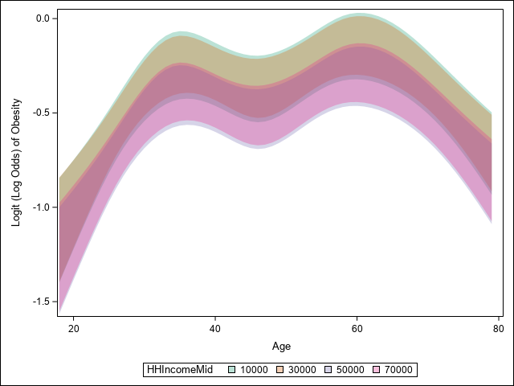
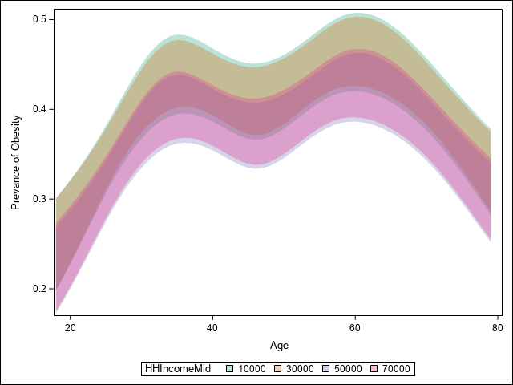
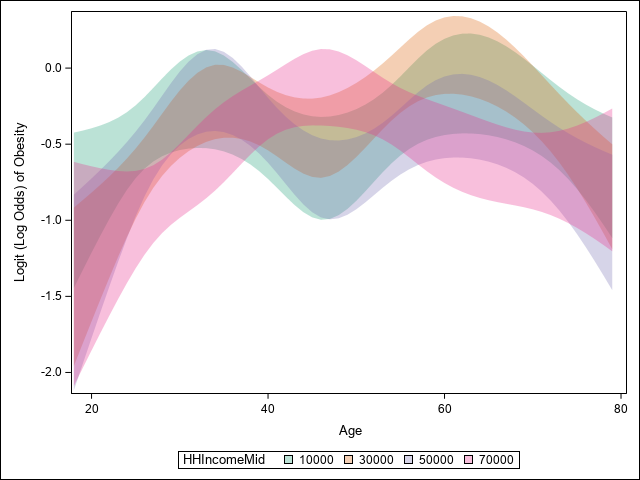
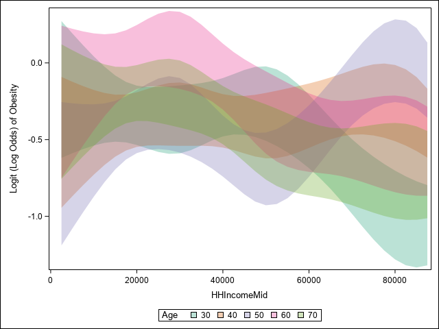
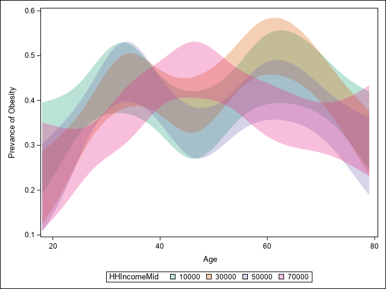
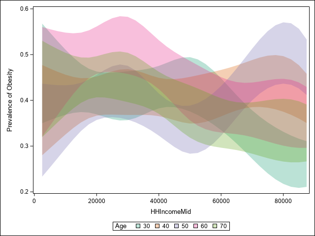

```{r global-options, include=FALSE}
knitr::opts_chunk$set(echo=TRUE, warning=FALSE, message=FALSE,
                      comment=FALSE)
require(SASmarkdown)

saspath <- "C:/Program Files/SASHome/SASFoundation/9.4/sas.exe"
#saspath <- "sas"
```

# Binary (Logistic) Regression with Two Quantitative Predictors

To illustrate a regression model with two quantitative predictors, we will develop a logistic regression model for obesity as a function of age (adults 18-79) and household income (up to \$100,000) for the US population. We will treat household income, an ordinal variable, as a quantitative variable coded using the midpoint values for each category. 

Age and household income are quantitative variables. As we've discussed, we typically model the effects of quantitative variables using natural cubic splines.  In formulating our initial model, we need to specify (1) the number of parameters (df) (complexity or degree of nonlinearity) for the age effect, (2) the number of parameters (df) (complexity or degree of nonlinearity) for the income effect, and (3) whether to assume additivity or to allow for possible interaction between age and income.

As we've discussed, a natural cubic spline with 4 df typically represents an appropriate balance between flexibility and loss of precision caused by overfitting. Small samples ($N < 30$) may require the use of 2 df, and moderate samples ($N < 100$) may require the use of 3 df. Empirical evidence suggests that more than 4 df are seldom required in a natural cubic spline regression model. Cubic spline models with 5 or 6 df would typically only be considered if the sample size was extremely large. 

Based on these considerations, we will represent age and income using a natural cubic spline with 4 df.

As discussed previously for two categorical predictors, the choice of an additive model or an interaction model depends primarily on the scientific context and, to a lesser extent, on the available sample size. In smaller samples, the number of parameters $p$ (regression coefficients) that can be reliably estimated is $m/15$, where $m$ is the *effective sample size* (for logistic regression, $m$ is the minimum of the number of events and the number of non-events in our sample).  

In this specific case, in my opinion, an additive model for the effects of age and income is potentially reasonable. 

So, our initial model is an additive logistic regression model for prevalence of obesity as a function of age (represented as a natural cubic spline with 4 df) and income (represented as a natural cubic spline with 4 df).

# Additive Model

We denote the obesity outcome for subject $i$ by $y_i$, the age for subject $i$ by $x_{1i}$, and the income for subject $i$ by $x_{2i}$. 

An additive logistic regression model for (prevalence of) obesity as a function of age and income is 
$$ y_i \sim \mbox{Bernoulli}\left\{p_i\right\} \\
\mbox{logit}\left\{p_i\right\} = \log{\left\{\frac{p_i}{1-p_i}\right\}} = \alpha_0 + f_{a}(x_{1i},{\bf \beta}) + f_{i}(x_{2i},{\bf \gamma})$$

For modeling, age will be represented by a *basis* for the natural cubic spline with 4 df (5 knots), e.g. $a_1(x_{2}), a_2(x_{2}), a_3(x_{2}), a_4(x_{2})$. 

In our regression model,
$$f_{a}(x_{2},{\bf \gamma}) = \gamma_1 a_1(x_{2}) + \gamma_2 a_2(x_{2}) + \gamma_3 a_3(x_{2}) + \gamma_4 a_4(x_{2})$$

For modeling, income will be represented by a *basis* for the natural cubic spline with 4 df (5 knots), e.g. $i_1(x_{2}), i_2(x_{2}), i_3(x_{2}), i_4(x_{2})$. 

In our regression model,
$$f_{i}(x_{2},{\bf \gamma}) = \gamma_1 i_1(x_{2}) + \gamma_2 i_2(x_{2}) + \gamma_3 i_3(x_{2}) + \gamma_4 i_4(x_{2})$$

```{r example1, engine="sashtml5", engine.path=saspath, collectcode=TRUE}
LIBNAME NHANES "../../../BMI552_Datasets/NHANES_May2023/";
*LIBNAME NHANES "~/my_shared_file_links/u48718377/NHANES";
OPTIONS FMTSEARCH=(NHANES.formats_NHANES work) NODATE NONUMBER;
TITLE1; TITLE2;
ODS NOPROCTITLE;
ODS GRAPHICS / LOESSMAXOBS=20000;

DATA Ron;
  SET NHANES.NHANES;
RUN;

ODS SELECT NONE;
PROC LOGISTIC DATA=Ron;
  ODS SELECT ResponseProfile;
*  ODS SELECT SplineKnots;
  EFFECT AgeCS=SPLINE(Age / NATURALCUBIC BASIS=TPF(NOINT) DEGREE=3 
                            KNOTMETHOD=PERCENTILELIST(5 27.5 50 72.5 95) DETAILS);
  EFFECT IncomeCS=SPLINE(HHIncomeMid / NATURALCUBIC BASIS=TPF(NOINT) DEGREE=3 
                            KNOTMETHOD=PERCENTILELIST(5 27.5 50 72.5 95) DETAILS);
    
  MODEL Obese(EVENT="Yes") = AgeCS IncomeCS / LINK=LOGIT;

  OUTPUT OUT=Tmp RESCHI=Residual PREDICTED=Fitted; 

  STORE AgeIncome;
RUN;
ODS SELECT ALL;
```

## Assessing Adequacy of Modeling Assumptions

Before using the model, we must evaluate the adequacy of the modeling assumptions. For logistic regression models, the only assumptions are correct structural model and independence (which cannot be evaluated based on the observed data).  We can identify potential inadequacies in the representation of the effects of age or income, e.g. insufficient df, or the assumption of additivity either using informal plots of the residuals against age by income or income by age or formal comparisons of fit (AIC or BIC) for models with more df devoted to the age effect or models with interaction terms.  

```{r example3, engine="sashtml5", engine.path=saspath}
PROC FORMAT;
  VALUE IncomeGrp
    LOW-19999="0-19999"
    20000-39999="20000-39999"
    40000-59999="40000-59999"
    60000-79999="60000-79999"
    80000-99999="80000-99999"
    ;

  VALUE AgeGrp
    LOW-29="18-29"
    30-39="30-39"
    40-49="40-49"
    50-59="50-59"
    60-69="60-69"
    70-79="70-79"
    ;
RUN;
        
PROC SGPANEL DATA=Tmp;
  FORMAT HHIncomeMid IncomeGrp.;
  LABEL HHIncomeMid="Household Income";
  PANELBY HHIncomeMid / LAYOUT=ROWLATTICE;
	REFLINE 0 / AXIS=Y;
  LOESS X=Age Y=Residual / JITTER; 
RUN;

PROC SGPANEL DATA=Tmp;
  FORMAT Age AgeGrp.;
  PANELBY Age / LAYOUT=ROWLATTICE;
	REFLINE 0 / AXIS=Y;
  LOESS X=HHIncomeMid Y=Residual / JITTER; 
RUN;
```

The lack of any consistent patterns in these plots suggests that the correct structural model assumption is valid.

The effective sample size is $2,592$.

```{r example4, engine="sashtml5", engine.path=saspath}
ODS EXCLUDE ALL;
PROC LOGISTIC DATA=Ron;
  ODS OUTPUT GlobalTests=DF4;
  EFFECT AgeCS=SPLINE(Age / 
      NATURALCUBIC BASIS=TPF(NOINT) KNOTMETHOD=PERCENTILELIST(5 27.5 50 72.5 95));
  EFFECT IncomeCS=SPLINE(HHIncomeMid / 
       NATURALCUBIC BASIS=TPF(NOINT) KNOTMETHOD=PERCENTILELIST(5 27.5 50 72.5 95));
    
  MODEL Obese(EVENT="Yes") = AgeCS IncomeCS / LINK=LOGIT;
RUN;

PROC LOGISTIC DATA=Ron;
  ODS OUTPUT GlobalTests=DF5;
  EFFECT AgeCS=SPLINE(Age / 
      NATURALCUBIC BASIS=TPF(NOINT) KNOTMETHOD=PERCENTILELIST(5 23 41 59 77 95));
  EFFECT IncomeCS=SPLINE(HHIncomeMid / 
       NATURALCUBIC BASIS=TPF(NOINT) KNOTMETHOD=EQUAL(6));
    
  MODEL Obese(EVENT="Yes") = AgeCS IncomeCS / LINK=LOGIT;
RUN;

PROC LOGISTIC DATA=Ron;
  ODS OUTPUT GlobalTests=DF6;
  EFFECT AgeCS=SPLINE(Age / 
      NATURALCUBIC BASIS=TPF(NOINT) KNOTMETHOD=PERCENTILELIST(2.5 18.3333 34.1667 50 65.8333 81.6667 97.5));
  EFFECT IncomeCS=SPLINE(HHIncomeMid / 
       NATURALCUBIC BASIS=TPF(NOINT) KNOTMETHOD=EQUAL(7));
    
  MODEL Obese(EVENT="Yes") = AgeCS IncomeCS / LINK=LOGIT;
RUN;


PROC LOGISTIC DATA=Ron;
  ODS OUTPUT GlobalTests=Interaction;
  EFFECT AgeCS=SPLINE(Age / 
      NATURALCUBIC BASIS=TPF(NOINT) KNOTMETHOD=PERCENTILELIST(5 27.5 50 72.5 95));
  EFFECT IncomeCS=SPLINE(HHIncomeMid / 
       NATURALCUBIC BASIS=TPF(NOINT) KNOTMETHOD=PERCENTILELIST(5 27.5 50 72.5 95));
    
  MODEL Obese(EVENT="Yes") = AgeCS IncomeCS AgeCS*IncomeCS / LINK=LOGIT;
RUN;

DATA DF4;
  SET DF4;
  WHERE Test="Likelihood Ratio";
    
  Model = "Age+Income 4df";
  AIC = ChiSq - 2*(DF+1);
  BIC = ChiSq - LOG(2592)*(DF+1);

  KEEP Model DF AIC BIC;    
RUN;

DATA DF5;
  SET DF5;
  WHERE Test="Likelihood Ratio";
    
  Model = "Age+Income 5df";
  AIC = ChiSq - 2*(DF+1);
  BIC = ChiSq - LOG(2592)*(DF+1);

  KEEP Model DF AIC BIC;    
RUN;

DATA DF6;
  SET DF6;
  WHERE Test="Likelihood Ratio";
    
  Model = "Age+Income 6df";
  AIC = ChiSq - 2*(DF+1);
  BIC = ChiSq - LOG(2592)*(DF+1);

  KEEP Model DF AIC BIC;    
RUN;

DATA Interaction;
  SET Interaction;
  WHERE Test="Likelihood Ratio";
    
  Model = "Interaction";
  AIC = ChiSq - 2*(DF+1);
  BIC = ChiSq - LOG(2592)*(DF+1);

  KEEP Model DF AIC BIC;    
RUN;

DATA ModelComparisons;
  LENGTH Model $20;

  SET DF4 DF5 DF6 Interaction;
    
  KEEP Model DF AIC BIC;    
RUN;

PROC MEANS DATA=ModelComparisons MAX NOPRINT;
  VAR AIC BIC;
  OUTPUT OUT=MaxIC MAX= / AUTONAME;
RUN;

DATA ModelComparisons;
  IF _N_=1 THEN SET MaxIC;
  SET ModelComparisons;
    
  AIC = AIC_Max - AIC;
  BIC = BIC_Max - BIC;
    
  KEEP Model DF AIC BIC;
RUN;
ODS EXCLUDE NONE;

TITLE "Model Comparisons (AIC/BIC)";
PROC PRINT DATA=ModelComparisons NOOBS;
  VAR Model DF AIC BIC;  
    
  FORMAT AIC BIC 6.1;
RUN;
TITLE;
```

Based on AIC, there is conclusive evidence for the interaction model, while, based on BIC, there is conclusive evidence for the additive model. In most situations, I will use BIC, which more strongly favors the pre-specified model, rather than AIC, which makes it easier to switch to a more complex model.  In practice, the choice of AIC or BIC should be made prior to examining the data.

## Odds Ratios for Age Adjusted for Income

ESTIMATE statements can be used to obtain the odds ratios comparing various pairs of ages adjusted for income.

```{r example5, engine="sashtml5", engine.path=saspath}
ODS EXCLUDE ALL;
PROC PLM RESTORE=AgeIncome;
  ODS OUTPUT Estimates=E;

  ESTIMATE "Age 30 v 20" AgeCS [1,30] [-1, 20] / CL EXP ALPHA=0.03125;
  ESTIMATE "Age 40 v 30" AgeCS [1,40] [-1, 30] / CL EXP ALPHA=0.03125;
  ESTIMATE "Age 50 v 40" AgeCS [1,50] [-1, 40] / CL EXP ALPHA=0.03125;
  ESTIMATE "Age 60 v 50" AgeCS [1,60] [-1, 50] / CL EXP ALPHA=0.03125;
  ESTIMATE "Age 70 v 60" AgeCS [1,70] [-1, 60] / CL EXP ALPHA=0.03125;
  ESTIMATE "Age 80 v 70" AgeCS [1,80] [-1, 70] / CL EXP ALPHA=0.03125;
  ESTIMATE "Age 30 v 50" AgeCS [1,30] [-1, 50] / CL EXP ALPHA=0.03125;
  ESTIMATE "Age 70 v 50" AgeCS [1,70] [-1, 50] / CL EXP ALPHA=0.03125;
RUN;
ODS EXCLUDE NONE;

PROC PRINT DATA=E NOOBS LABEL;
  VAR Label LowerExp ExpEstimate UpperExp;
  LABEL Label='00'x
      LowerExp="Lower CL"
      ExpEstimate="Estimate"
      UpperExp="Upper CL";
  TITLE "Odds Ratios for Age Adjusted for Income";
RUN;
TITLE;
```

Adjusted for income, the odds ratios for obesity are $(1.46,2.34)$ comparing age 30 to age 20, $(0.97,1.20)$ comparing age 40 to age 30, $(0.87,1.08)$ comparing age 50 to age 40, $(1.05,1.37)$ comparing age 60 to age 50, $(0.75,0.90)$ comparing age 70 to age 60, and $(0.55,0.78)$ comparing age 80 to age 70.

## Odds Ratios for Income Adjusted for Age

ESTIMATE statements can be used to obtain the odds ratios comparing various pairs of incomes adjusted for age.

```{r example16, engine="sashtml5", engine.path=saspath}
ODS EXCLUDE ALL;
PROC PLM RESTORE=AgeIncome;
  ODS OUTPUT Estimates=E;

  ESTIMATE "Income $7,500 v $2,500" IncomeCS [1, 7500] [-1, 2500] / CL EXP ALPHA=0.03125;
  ESTIMATE "Income $12,500 v $7,500" IncomeCS [1, 12500] [-1, 7500] / CL EXP ALPHA=0.03125;
  ESTIMATE "Income $17,500 v $12,500" IncomeCS [1, 17500] [-1, 12500] / CL EXP ALPHA=0.03125;
  ESTIMATE "Income $22,500 v $17,500" IncomeCS [1, 22500] [-1, 175500] / CL EXP ALPHA=0.03125;
  ESTIMATE "Income $30,000 v $22,500" IncomeCS [1, 30000] [-1, 22500] / CL EXP ALPHA=0.03125;
  ESTIMATE "Income $40,000 v $30,000" IncomeCS [1, 40000] [-1, 30000] / CL EXP ALPHA=0.03125;
  ESTIMATE "Income $50,000 v $40,000" IncomeCS [1, 50000] [-1, 40000] / CL EXP ALPHA=0.03125;
  ESTIMATE "Income $60,000 v $50,000" IncomeCS [1, 60000] [-1, 50000] / CL EXP ALPHA=0.03125;
  ESTIMATE "Income $70,000 v $60,000" IncomeCS [1, 70000] [-1, 60000] / CL EXP ALPHA=0.03125;
  ESTIMATE "Income $87,500 v $70,000" IncomeCS [1, 87500] [-1, 70000] / CL EXP ALPHA=0.03125;
RUN;
ODS EXCLUDE NONE;

PROC PRINT DATA=E NOOBS LABEL;
  VAR Label LowerExp ExpEstimate UpperExp;
  LABEL Label='00'x
      LowerExp="Lower CL"
      ExpEstimate="Estimate"
      UpperExp="Upper CL";
  TITLE "Odds Ratios for Income Adjusted for Age";
RUN;
TITLE;
```

Adjusted for age, the odds ratios for obesity are $(0.95,1.08)$ comparing a household income of \$7,500 to \$2,500, $(0.95,1.08)$ comparing a household income of \$17,500 to \$12,500, $(0.93,1.03)$ comparing a household income of \$30,000 to \$22,500, $(0.84,1.01)$ comparing a household income of \$50,000 to \$40,000, and $(0.94,1.12)$ comparing a household income of \$70,000 to \$60,000. 

## Odds Ratio for Arbitrary Age-Income Combinations

ESTIMATE statements can be used to obtain the odds ratios comparing any two combinations of age and income.

```{r example7, engine="sashtml5", engine.path=saspath}
ODS EXCLUDE ALL;
PROC PLM RESTORE=AgeIncome;
  ODS OUTPUT Estimates=E;

  ESTIMATE "Age 30, Income $22,500 v Age 50, Income $87,500" AgeCS [1, 30] [-1, 50]
      IncomeCS [1, 22500] [-1, 87500] / CL EXP ALPHA=0.03125;
  ESTIMATE "Age 30, Income $50,000 v Age 50, Income $87,500" AgeCS [1, 30] [-1, 50]
      IncomeCS [1, 50000] [-1, 87500] / CL EXP ALPHA=0.03125;
  ESTIMATE "Age 70, Income $22,500 v Age 50, Income $87,500" AgeCS [1, 70] [-1, 50]
      IncomeCS [1, 22500] [-1, 87500] / CL EXP ALPHA=0.03125;
  ESTIMATE "Age 70, Income $50,000 v Age 50, Income $87,500" AgeCS [1, 70] [-1, 50]
      IncomeCS [1, 50000] [-1, 87500] / CL EXP ALPHA=0.03125;
RUN;
ODS EXCLUDE NONE;

PROC PRINT DATA=E NOOBS LABEL;
  VAR Label LowerExp ExpEstimate UpperExp;
  LABEL Label='00'x
      LowerExp="Lower CL"
      ExpEstimate="Estimate"
      UpperExp="Upper CL";
  TITLE "Odds Ratios";
RUN;
TITLE;
```

The odds ratios for obesity are $(0.99,1.57)$ comparing 30-year-olds with a household income of \$22,500 to 50-year-olds with a household income of \$87,500, $(0.79,1.36)$ comparing 30-year-olds with a household income of \$50,000 to 50-year-olds with a household income of \$87,500, $(1.05,1.59)$ comparing 70-year-olds with a household income of \$22,500 to 50-year-olds with a household income of \$87,500, and $(0.83,1.39)$ comparing 70-year-olds with a household income of \$50,000 to 50-year-olds with a household income of \$87,500. 


## Prevalence by Age and Income

ESTIMATE statements can be used to obtain the prevalence of obesity for any combination of age and income. Note that, in the context of the current model, the prevalence of obesity cannot be obtained for a specific age without also specifying a specific income (and vice versa).  There is no single prevalence of obesity for 50 year olds.


```{r example8, engine="sashtml5", engine.path=saspath}
ODS EXCLUDE ALL;
PROC PLM RESTORE=AgeIncome;
  ODS OUTPUT Estimates=E;

  ESTIMATE "Age 30, Income $7,500"  Intercept 1 AgeCS [1, 30] IncomeCS [1, 7500] 
      / CL ILINK ALPHA=0.03125;
  ESTIMATE "Age 50, Income $7,500"  Intercept 1 AgeCS [1, 50] IncomeCS [1, 7500] 
       / CL ILINK ALPHA=0.03125;
  ESTIMATE "Age 70, Income $7,500"  Intercept 1 AgeCS [1, 70] IncomeCS [1, 7500] 
      / CL ILINK ALPHA=0.03125;
  ESTIMATE "Age 30, Income $70,000"  Intercept 1 AgeCS [1, 30] IncomeCS [1, 70000] 
      / CL ILINK ALPHA=0.03125;
  ESTIMATE "Age 50, Income $70,000"  Intercept 1 AgeCS [1, 50] IncomeCS [1, 70000] 
      / CL ILINK ALPHA=0.03125;
  ESTIMATE "Age 70, Income $70,000"  Intercept 1 AgeCS [1, 70] IncomeCS [1, 70000] 
      / CL ILINK ALPHA=0.03125;
RUN;
ODS EXCLUDE NONE;

PROC PRINT DATA=E NOOBS LABEL;
  VAR Label LowerMu Mu UpperMu;
  LABEL Label='00'x
      Mu="Estimate"
      LowerMu="Lower CL"
      UpperMu="Upper CL";
  TITLE "Prevalence of Obesity (Additive)";
RUN;
TITLE;
```

The estimated prevalence of obesity is $(0.36,0.45)$ for 30-year-olds with a household income of \$7,500, $(0.37,0.46)$ for 50-year-olds with a household income of \$7,500, and $(0.37,0.46)$ for 70-year-olds with a household income of \$7,500; it is $(0.34,0.41)$ for 30-year-olds with a household income of \$70,000, $(0.35,0.42)$ for 50-year-olds with a household income of \$70,000, and $(0.35,0.42)$ for 70-year-olds with a household income of \$70,000.

The estimated regression functions (log odds of obesity as a function of age and race) from the additive model can be plotted using PROC SGPLOT.

```{r fitted1, engine="sashtml5", engine.path=saspath, collectcode=TRUE, results='hide'}
ODS EXCLUDE ALL;  
DATA AllAgesAllIncomes;
  DO HHIncomeMid = 2500 TO 87500 BY 2500;
    DO Age = 18 TO 79 BY 1;
      OUTPUT;
    END;
  END;
RUN;

PROC PLM RESTORE=AgeIncome;
  SCORE DATA=AllAgesAllIncomes OUT=Fitted Predicted LCLM=Lower_Logit UCLM=Upper_Logit / ALPHA=0.03125;
RUN;
      
DATA Fitted;
  SET Fitted;
      
  Lower_Prob = 1/(1+EXP(-Lower_Logit));
  Upper_Prob = 1/(1+EXP(-Upper_Logit));
RUN;      
ODS EXCLUDE NONE;

PROC SGPLOT DATA=Fitted;
  STYLEATTRS DATACOLORS=(Cx1b9e77 Cxd95f02 Cx7570b3 Cxe7298a Cx66a61e Cxe6ab02 Cxa6761d Cx666666);
  BAND X=Age Lower=Lower_Logit Upper=Upper_Logit /
      GROUP=HHIncomeMid TRANSPARENCY=0.7;
  YAXIS LABEL="Logit (Log Odds) of Obesity";
  WHERE HHIncomeMid IN (10000 30000 50000 70000);
RUN;

PROC SGPLOT DATA=Fitted;
  STYLEATTRS DATACOLORS=(Cx1b9e77 Cxd95f02 Cx7570b3 Cxe7298a Cx66a61e Cxe6ab02 Cxa6761d Cx666666);
  BAND X=HHIncomeMid Lower=Lower_Logit Upper=Upper_Logit /
      GROUP=Age TRANSPARENCY=0.7;
  YAXIS LABEL="Logit (Log Odds) of Obesity";
  WHERE Age IN (30 40 50 60 70);
RUN;
```


```{r, echo=FALSE}

knitr::include_graphics("SGPlot1.png")
```

Alternatively, the estimated prevalence of obesity can also be plotted using PROC SGPLOT.

```{r fitted2, engine="sashtml5", engine.path=saspath, collectcode=TRUE, results='hide'}
PROC SGPLOT DATA=Fitted;
  STYLEATTRS DATACOLORS=(Cx1b9e77 Cxd95f02 Cx7570b3 Cxe7298a Cx66a61e Cxe6ab02 Cxa6761d Cx666666);
  BAND X=Age Lower=Lower_Prob Upper=Upper_Prob /
      GROUP=HHIncomeMid TRANSPARENCY=0.7;
  YAXIS LABEL="Prevance of Obesity";
  WHERE HHIncomeMid IN (10000 30000 50000 70000);
RUN;

PROC SGPLOT DATA=Fitted;
  STYLEATTRS DATACOLORS=(Cx1b9e77 Cxd95f02 Cx7570b3 Cxe7298a Cx66a61e Cxe6ab02 Cxa6761d Cx666666);
  BAND X=HHIncomeMid Lower=Lower_Prob Upper=Upper_Prob /
      GROUP=Age TRANSPARENCY=0.7;
  YAXIS LABEL="Prevalence of Obesity";
  WHERE Age IN (30 40 50 60 70);
RUN;
```

```{r, echo=FALSE}

knitr::include_graphics("SGPlot3.png")
```

## Hypothesis Tests

Likelihood ratio tests can be used to assess the evidence for (1) any effect of age on prevalence of obesity after accounting for income, (2) any effect of income on prevalence of obesity after accounting for age, (3) non-linearity of the effect(s) of age, and (4) non-linearity of the effect(s) of income. In general, one should not reduce the complexity of the model (drop variables) based on the results of a hypothesis test.

```{r example9, engine="sashtml5", engine.path=saspath}
ODS EXCLUDE ALL;
PROC LOGISTIC DATA=Ron;
  ODS OUTPUT GlobalTests=Full;
  EFFECT AgeCS=SPLINE(Age / NATURALCUBIC BASIS=TPF(NOINT) DEGREE=3 
                            KNOTMETHOD=PERCENTILELIST(5 27.5 50 72.5 95) DETAILS);
  EFFECT IncomeCS=SPLINE(HHIncomeMid / NATURALCUBIC BASIS=TPF(NOINT) DEGREE=3 
                            KNOTMETHOD=PERCENTILELIST(5 27.5 50 72.5 95) DETAILS);
    
  MODEL Obese(EVENT="Yes") = AgeCS IncomeCS / LINK=LOGIT;
RUN;

PROC LOGISTIC DATA=Ron;
  ODS OUTPUT GlobalTests=LinearAge;
  EFFECT IncomeCS=SPLINE(HHIncomeMid / NATURALCUBIC BASIS=TPF(NOINT) DEGREE=3 
                            KNOTMETHOD=PERCENTILELIST(5 27.5 50 72.5 95) DETAILS);
    
  MODEL Obese(EVENT="Yes") = Age IncomeCS / LINK=LOGIT;
RUN;

PROC LOGISTIC DATA=Ron;
  ODS OUTPUT GlobalTests=LinearIncome;
  EFFECT AgeCS=SPLINE(Age / NATURALCUBIC BASIS=TPF(NOINT) DEGREE=3 
                            KNOTMETHOD=PERCENTILELIST(5 27.5 50 72.5 95) DETAILS);

  MODEL Obese(EVENT="Yes") = AgeCS HHIncomeMid / LINK=LOGIT;
RUN;

PROC LOGISTIC DATA=Ron;
  ODS OUTPUT GlobalTests=AgeOnly;
  EFFECT AgeCS=SPLINE(Age / NATURALCUBIC BASIS=TPF(NOINT) DEGREE=3 
                            KNOTMETHOD=PERCENTILELIST(5 27.5 50 72.5 95) DETAILS);

  MODEL Obese(EVENT="Yes") = AgeCS / LINK=LOGIT;
RUN;

PROC LOGISTIC DATA=Ron;
  ODS OUTPUT GlobalTests=IncomeOnly;
  EFFECT IncomeCS=SPLINE(HHIncomeMid / NATURALCUBIC BASIS=TPF(NOINT) DEGREE=3 
                            KNOTMETHOD=PERCENTILELIST(5 27.5 50 72.5 95) DETAILS);
    
  MODEL Obese(EVENT="Yes") = IncomeCS / LINK=LOGIT;
RUN;

DATA Full;
  SET Full;
  WHERE Test="Likelihood Ratio";
  RENAME ChiSq=ChiSq_Full DF=DF_Full;
RUN;

DATA LinearAge;
  LENGTH Model $30 Test $30;
  SET LinearAge;
  WHERE Test="Likelihood Ratio";
    
  Model = "Income+Linear Age";
  Test = "Non-Linear Age";
    
  KEEP Model Test ChiSq DF;
RUN;

DATA LinearIncome;
  LENGTH Model $30 Test $30;
  SET LinearIncome;
  WHERE Test="Likelihood Ratio";
    
  Model = "Age+Linear Income";
  Test = "Non-Linear Income";
    
  KEEP Model Test ChiSq DF;
RUN;

DATA IncomeOnly;
  LENGTH Model $30 Test $30;
  SET IncomeOnly;
  WHERE Test="Likelihood Ratio";
    
  Model = "Income Only";
  Test = "Age";
    
  KEEP Model Test ChiSq DF;
RUN;

DATA AgeOnly;
  LENGTH Model $30 Test $30;
  SET AgeOnly;
  WHERE Test="Likelihood Ratio";
    
  Model = "Age Only";
  Test = "Income";
    
  KEEP Model Test ChiSq DF;
RUN;

DATA LRTests;
  LENGTH Model $30 Test $30;

  IF _N_ = 1 THEN SET Full;
  SET LinearAge LinearIncome AgeOnly IncomeOnly;
    
  Chisq = Chisq_Full-Chisq;
  DF = DF_Full - DF;
  ProbChiSq = EXP(LOGSDF("CHISQUARE",Chisq,DF));
  sValue = -LOG(ProbChiSq)/LOG(2);
    
  KEEP Test DF ChiSq ProbChiSq sValue;    
RUN;
ODS EXCLUDE NONE;

TITLE "Likelihood Ratio Tests";
PROC PRINT DATA=LRTests NOOBS;
  VAR Test DF ChiSq ProbChiSq sValue;  

  FORMAT sValue 6.2;
  FORMAT ChiSq 6.2;
RUN;
TITLE;
```

There is extremely strong evidence that the prevalence of obesity varies by age $(p \approx 0, s=43.5)$; the relationship between age and the log odds of obesity is non-linear $(p \approx 0, s=42.7)$.

There is very strong evidence that the prevalence of obesity varies by income $(p \approx 0, s=46.0)$; there is some evidence that the relationship between income and the log odds of obesity is non-linear $(p=0.01, s=6.3)$.

# Interaction Model

We denote the obesity outcome for subject $i$ by $y_i$, the age for subject $i$ by $x_{1i}$, and the income for subject $i$ by $x_{2i}$.

A logistic regression model for (prevalence of) obesity as a function of age, income and their interaction is
$$ y_i \sim \mbox{Bernoulli}\left\{p_i\right\} \\
\mbox{logit}\left\{p_i\right\} = \log{\left\{\frac{p_i}{1-p_i}\right\}} = \alpha_0 + f_{a}(x_{1i},{\bf \beta}) + f_{i}(x_{2i},{\bf \gamma}) + f_{a,i}(x_{1i},x_{2i},{\bf \delta})$$

In our regression model, the interaction term is represented as
$$\begin{eqnarray*}
f_{a,i}(x_{1}, x_{2}, {\bf \delta}) & = & \delta_{11} a_1(x_{1}) \times i_1(x_{2}) + \delta_{12} a_1(x_{1}) \times i_2(x_{2}) + \delta_{13} a_1(x_{1}) \times i_3(x_{2}) + \delta_{14} a_1(x_{1}) \times i_4(x_{2}) + \\
& & \delta_{21} a_2(x_{1}) \times i_1(x_{2}) + \delta_{22} a_2(x_{1}) \times i_2(x_{2}) + \delta_{23} a_2(x_{1}) \times i_3(x_{2}) + \delta_{24} a_2(x_{1}) \times i_4(x_{2}) + \\
& & \delta_{31} a_3(x_{1}) \times i_1(x_{2}) + \delta_{32} a_3(x_{1}) \times i_2(x_{2}) + \delta_{33} a_3(x_{1}) \times i_3(x_{2}) + \delta_{34} a_4(x_{1}) \times i_3(x_{2}) + \\
& & \delta_{41} a_4(x_{1}) \times i_1(x_{2}) + \delta_{42} a_4(x_{1}) \times i_2(x_{2}) + \delta_{43} a_4(x_{1}) \times i_3(x_{2}) + \delta_{44} a_4(x_{1}) \times i_4(x_{2}) \\
\end{eqnarray*}$$

This representation of the interaction term is based on $16~=4 \times 4$ products of the 4 variables used to encode age $a_1(x_1), a_2(x_1), a_3(x_1), a_4(x_1)$ and the 4 variables used to encode income $i_1(x_2), i_2(x_2), i_3(x_2), i_4(x_2)$; it is called a *tensor product* spline.

```{r example10, engine="sashtml5", engine.path=saspath, collectcode=TRUE}
ODS SELECT NONE;
PROC LOGISTIC DATA=Ron;
*  ODS SELECT ResponseProfile;
*  ODS SELECT SplineKnots;
  EFFECT AgeCS=SPLINE(Age / NATURALCUBIC BASIS=TPF(NOINT) DEGREE=3 
                            KNOTMETHOD=PERCENTILELIST(5 27.5 50 72.5 95) DETAILS);
  EFFECT IncomeCS=SPLINE(HHIncomeMid / NATURALCUBIC BASIS=TPF(NOINT) DEGREE=3 
                            KNOTMETHOD=PERCENTILELIST(5 27.5 50 72.5 95) DETAILS);
    
  MODEL Obese(EVENT="Yes") = AgeCS IncomeCS AgeCS*IncomeCS / LINK=LOGIT;

  OUTPUT OUT=Tmp RESCHI=Residual PREDICTED=Fitted; 

  STORE AgeIncome;
RUN;
ODS SELECT ALL;
```

## Assessing Adequacy of Modeling Assumptions

Before using the model, we must evaluate the adequacy of the modeling assumptions. For binary regression models, the only assumptions are correct structural model and independence (which cannot be evaluated based on the observed data).  We can identify potential inadequacies in the representation of age and/or income, e.g. insufficient df, either using informal plots of the residuals against age by income or income by age or formal comparisons of fit (AIC or BIC) for models with more df devoted to the age effect.

```{r example14, engine="sashtml5", engine.path=saspath}
PROC FORMAT;
  VALUE IncomeGrp
    LOW-19999="0-19999"
    20000-39999="20000-39999"
    40000-59999="40000-59999"
    60000-79999="60000-79999"
    80000-99999="80000-99999"
    ;

  VALUE AgeGrp
    LOW-29="18-29"
    30-39="30-39"
    40-49="40-49"
    50-59="50-59"
    60-69="60-69"
    70-79="70-79"
    ;
RUN;
        
PROC SGPANEL DATA=Tmp;
  FORMAT HHIncomeMid IncomeGrp.;
  LABEL HHIncomeMid="Household Income";
  PANELBY HHIncomeMid / LAYOUT=ROWLATTICE;
	REFLINE 0 / AXIS=Y;
  LOESS X=Age Y=Residual / JITTER;
RUN;

PROC SGPANEL DATA=Tmp;
  FORMAT Age AgeGrp.;
  PANELBY Age / LAYOUT=ROWLATTICE;
	REFLINE 0 / AXIS=Y;
  LOESS X=HHIncomeMid Y=Residual / JITTER; 
RUN;
```

The lack of any consistent patterns in these plots suggests that the correct structural model assumption is valid.

The effective sample size is $2,592$.

```{r example20, engine="sashtml5", engine.path=saspath}
ODS EXCLUDE ALL;
PROC LOGISTIC DATA=Ron;
  ODS OUTPUT GlobalTests=DF4;
  EFFECT AgeCS=SPLINE(Age / 
      NATURALCUBIC BASIS=TPF(NOINT) KNOTMETHOD=PERCENTILELIST(5 27.5 50 72.5 95));
  EFFECT IncomeCS=SPLINE(HHIncomeMid / 
       NATURALCUBIC BASIS=TPF(NOINT) KNOTMETHOD=PERCENTILELIST(5 27.5 50 72.5 95));
    
  MODEL Obese(EVENT="Yes") = AgeCS IncomeCS AgeCS*IncomeCS / LINK=LOGIT;
RUN;

PROC LOGISTIC DATA=Ron;
  ODS OUTPUT GlobalTests=DF5;
  EFFECT AgeCS=SPLINE(Age / 
      NATURALCUBIC BASIS=TPF(NOINT) KNOTMETHOD=PERCENTILELIST(5 23 41 59 77 95));
  EFFECT IncomeCS=SPLINE(HHIncomeMid / 
       NATURALCUBIC BASIS=TPF(NOINT) KNOTMETHOD=EQUAL(6));
    
  MODEL Obese(EVENT="Yes") = AgeCS IncomeCS AgeCS*IncomeCS / LINK=LOGIT;
RUN;

PROC LOGISTIC DATA=Ron;
  ODS OUTPUT GlobalTests=DF6;
  EFFECT AgeCS=SPLINE(Age / 
      NATURALCUBIC BASIS=TPF(NOINT) KNOTMETHOD=PERCENTILELIST(2.5 18.3333 34.1667 50 65.8333 81.6667 97.5));
  EFFECT IncomeCS=SPLINE(HHIncomeMid / 
       NATURALCUBIC BASIS=TPF(NOINT) KNOTMETHOD=EQUAL(7));
    
  MODEL Obese(EVENT="Yes") = AgeCS IncomeCS AgeCS*IncomeCS / LINK=LOGIT;
RUN;

DATA DF4;
  SET DF4;
  WHERE Test="Likelihood Ratio";
    
  Model = "Age+Income 4df";
  AIC = ChiSq - 2*(DF+1);
  BIC = ChiSq - LOG(2592)*(DF+1);

  KEEP Model DF AIC BIC;    
RUN;

DATA DF5;
  SET DF5;
  WHERE Test="Likelihood Ratio";
    
  Model = "Age+Income 5df";
  AIC = ChiSq - 2*(DF+1);
  BIC = ChiSq - LOG(2592)*(DF+1);

  KEEP Model DF AIC BIC;    
RUN;

DATA DF6;
  SET DF6;
  WHERE Test="Likelihood Ratio";
    
  Model = "Age+Income 6df";
  AIC = ChiSq - 2*(DF+1);
  BIC = ChiSq - LOG(2592)*(DF+1);

  KEEP Model DF AIC BIC;    
RUN;

DATA ModelComparisons;
  LENGTH Model $20;

  SET DF4 DF5 DF6;
    
  KEEP Model DF AIC BIC;    
RUN;

PROC MEANS DATA=ModelComparisons MAX NOPRINT;
  VAR AIC BIC;
  OUTPUT OUT=MaxIC MAX= / AUTONAME;
RUN;

DATA ModelComparisons;
  IF _N_=1 THEN SET MaxIC;
  SET ModelComparisons;
    
  AIC = AIC_Max - AIC;
  BIC = BIC_Max - BIC;
    
  KEEP Model DF AIC BIC;
RUN;
ODS EXCLUDE NONE;

TITLE "Model Comparisons (AIC/BIC)";
PROC PRINT DATA=ModelComparisons NOOBS;
  VAR Model DF AIC BIC;  
    
  FORMAT AIC BIC 6.1;
RUN;
TITLE;
```

The pre-specified model with 4df for age and income is optimal using either AIC or BIC.

## Odds Ratios for Age by Income

ESTIMATE statements can be used to obtain the odds ratios comparing various pairs of ages at the same fixed income.

```{r example23, engine="sashtml5", engine.path=saspath}
ODS EXCLUDE ALL;
PROC PLM RESTORE=AgeIncome;
  ODS OUTPUT Estimates=E;

  ESTIMATE "Age 30 v 50 for Income $12,500" AgeCS [1,30] [-1, 50] 
      AgeCS*IncomeCS [1, 30 12500] [-1, 50 12500] / CL EXP ALPHA=0.03125;
  ESTIMATE "Age 70 v 50 for Income $12,500" AgeCS [1,70] [-1, 50] 
      AgeCS*IncomeCS [1, 70 12500] [-1, 50 12500] / CL EXP ALPHA=0.03125;
  ESTIMATE "Age 30 v 50 for Income $50,000" AgeCS [1,30] [-1, 50] 
      AgeCS*IncomeCS [1, 30 50000] [-1, 50 50000] / CL EXP ALPHA=0.03125;
  ESTIMATE "Age 70 v 50 for Income $50,000" AgeCS [1,70] [-1, 50] 
      AgeCS*IncomeCS [1, 70 50000] [-1, 50 50000] / CL EXP ALPHA=0.03125;
  ESTIMATE "Age 30 v 50 for Income $87,500" AgeCS [1,30] [-1, 50] 
      AgeCS*IncomeCS [1, 30 87500] [-1, 50 87500] / CL EXP ALPHA=0.03125;
  ESTIMATE "Age 70 v 50 for Income $87,500" AgeCS [1,70] [-1, 50] 
      AgeCS*IncomeCS [1, 70 87500] [-1, 50 87500] / CL EXP ALPHA=0.03125;
RUN;
ODS EXCLUDE NONE;

PROC PRINT DATA=E NOOBS LABEL;
  VAR Label LowerExp ExpEstimate UpperExp;
  LABEL Label='00'x
      LowerExp="Lower CL"
      ExpEstimate="Estimate"
      UpperExp="Upper CL";
  TITLE "Odds Ratios for Age Adjusted for Income";
RUN;
TITLE;
```

The odds ratios for obesity comparing 30-year-olds to 50-year-olds are $(0.85,1.92)$ for a household income of \$12,500, $(1.04,2.26)$ for a household income of \$50,000, and $(0.26,0.58)$ for a household income of \$87,500, while the odds ratios for obesity comparing 70-year-olds to 50-year-olds are $(0.92,1.90)$ for a household income of \$12,500, $(0.84,1.69)$ for a household income of \$50,000, and $(0.36,0.80)$ for a household income of \$87,500.


## Odds Ratios for Income by Age

ESTIMATE statements can be used to obtain the odds ratios comparing various pairs of incomes at the same fixed age.

```{r example24, engine="sashtml5", engine.path=saspath}
ODS EXCLUDE ALL;
PROC PLM RESTORE=AgeIncome;
  ODS OUTPUT Estimates=E;

  ESTIMATE "Income $12,500 v $50,000 for Age 30" IncomeCS [1, 12500] [-1, 50000] 
      AgeCS*IncomeCS [1, 30 12500] [-1, 30 50000] / CL EXP ALPHA=0.03125;
  ESTIMATE "Income $12,500 v $50,000 for Age 50" IncomeCS [1, 12500] [-1, 50000] 
      AgeCS*IncomeCS [1, 50 12500] [-1, 50 50000] / CL EXP ALPHA=0.03125;
  ESTIMATE "Income $12,500 v $50,000 for Age 70" IncomeCS [1, 12500] [-1, 50000] 
      AgeCS*IncomeCS [1, 70 12500] [-1, 70 50000] / CL EXP ALPHA=0.03125;
  ESTIMATE "Income $87,500 v $50,000 for Age 30" IncomeCS [1, 87500] [-1, 50000] 
      AgeCS*IncomeCS [1, 30 87500] [-1, 30 50000] / CL EXP ALPHA=0.03125;
  ESTIMATE "Income $87,500 v $50,000 for Age 50" IncomeCS [1, 87500] [-1, 50000] 
      AgeCS*IncomeCS [1, 50 87500] [-1, 50 50000] / CL EXP ALPHA=0.03125;
  ESTIMATE "Income $87,500 v $50,000 for Age 70" IncomeCS [1, 87500] [-1, 50000] 
      AgeCS*IncomeCS [1, 70 87500] [-1, 70 50000] / CL EXP ALPHA=0.03125;
RUN;
ODS EXCLUDE NONE;

PROC PRINT DATA=E NOOBS LABEL;
  VAR Label LowerExp ExpEstimate UpperExp;
  LABEL Label='00'x
      LowerExp="Lower CL"
      ExpEstimate="Estimate"
      UpperExp="Upper CL";
  TITLE "Odds Ratios for Age Adjusted for Income";
RUN;
TITLE;
```

The odds ratios for obesity comparing household incomes of \$12,500 to \$50,000 are $(0.83,1.69)$ for age 30, $(0.93,1.84)$ for age 50, and $(0.97,2.09)$ for age 70, while the odds ratios for obesity comparing household incomes of \$87,500 to \$50,000 are $(0.30,0.68)$ for age 30, $(1.21,2.63)$ for age 50, and $(0.53,1.24)$ for age 70.

## Odds Ratios for Arbitrary Age-Income Combinations

ESTIMATE statements can be used to obtain the odds ratios comparing any two combinations of age and income.

```{r example25, engine="sashtml5", engine.path=saspath}
ODS EXCLUDE ALL;
PROC PLM RESTORE=AgeIncome;
  ODS OUTPUT Estimates=E;

  ESTIMATE "Age 30, Income $22,500 v Age 50, Income $87,500" AgeCS [1, 30] [-1, 50]
      IncomeCS [1, 22500] [-1, 87500] 
      AgeCS*IncomeCS [1, 30 22500] [-1, 50 87500] / CL EXP ALPHA=0.03125;
  ESTIMATE "Age 30, Income $50,000 v Age 50, Income $87,500" AgeCS [1, 30] [-1, 50]
      IncomeCS [1, 50000] [-1, 87500] 
      AgeCS*IncomeCS [1, 30 50000] [-1, 50 87500] / CL EXP ALPHA=0.03125;
  ESTIMATE "Age 70, Income $22,500 v Age 50, Income $87,500" AgeCS [1, 70] [-1, 50]
      IncomeCS [1, 22500] [-1, 87500] 
      AgeCS*IncomeCS [1, 70 22500] [-1, 50 87500] / CL EXP ALPHA=0.03125;
  ESTIMATE "Age 70, Income $50,000 v Age 50, Income $87,500" AgeCS [1, 70] [-1, 50]
      IncomeCS [1, 50000] [-1, 87500] 
      AgeCS*IncomeCS [1, 70 50000] [-1, 50 87500] / CL EXP ALPHA=0.03125;
RUN;
ODS EXCLUDE NONE;

PROC PRINT DATA=E NOOBS LABEL;
  VAR Label LowerExp ExpEstimate UpperExp;
  LABEL Label='00'x
      LowerExp="Lower CL"
      ExpEstimate="Estimate"
      UpperExp="Upper CL";
  TITLE "Odds Ratios";
RUN;
TITLE;
```

The odds ratios for obesity are $(0.57,1.08)$ comparing 30-year-olds with a household income of \$22,500 to 50-year-olds with a household income of \$87,500, $(0.62,1.19)$ comparing 30-year-olds with a household income of \$50,000 to 50-year-olds with a household income of \$87,500, $(0.68,1.27)$ comparing 70-year-olds with a household income of \$22,500 to 50-year-olds with a household income of \$87,500, and $(0.47,0.94)$ comparing 70-year-olds with a household income of \$50,000 to 50-year-olds with a household income of \$87,500.


## Prevalence by Age and Income

ESTIMATE statements can be used to obtain the prevalence of obesity for any combination of age and income. Note that, in the context of the current model, the prevalence of obesity cannot be obtained for a specific age without also specifying a specific income (and vice versa).  There is no single prevalence of obesity for 50 year olds.


```{r example26, engine="sashtml5", engine.path=saspath}
ODS EXCLUDE ALL;
PROC PLM RESTORE=AgeIncome;
  ODS OUTPUT Estimates=E;

  ESTIMATE "Age 30, Income $7,500"  Intercept 1 AgeCS [1, 30] IncomeCS [1, 7500] 
      AgeCS*IncomeCS [1, 30 7500] / CL ILINK ALPHA=0.03125;
  ESTIMATE "Age 50, Income $7,500"  Intercept 1 AgeCS [1, 50] IncomeCS [1, 7500] 
       AgeCS*IncomeCS [1, 50 7500] / CL ILINK ALPHA=0.03125;
  ESTIMATE "Age 70, Income $7,500"  Intercept 1 AgeCS [1, 70] IncomeCS [1, 7500] 
      AgeCS*IncomeCS [1, 70 7500] / CL ILINK ALPHA=0.03125;
  ESTIMATE "Age 30, Income $70,000"  Intercept 1 AgeCS [1, 30] IncomeCS [1, 70000] 
      AgeCS*IncomeCS [1, 30 70000] / CL ILINK ALPHA=0.03125;
  ESTIMATE "Age 50, Income $70,000"  Intercept 1 AgeCS [1, 50] IncomeCS [1, 70000] 
      AgeCS*IncomeCS [1, 50 70000] / CL ILINK ALPHA=0.03125;
  ESTIMATE "Age 70, Income $70,000"  Intercept 1 AgeCS [1, 70] IncomeCS [1, 70000] 
      AgeCS*IncomeCS [1, 70 70000] / CL ILINK ALPHA=0.03125;
RUN;
ODS EXCLUDE NONE;

PROC PRINT DATA=E NOOBS LABEL;
  VAR Label LowerMu Mu UpperMu;
  LABEL Label='00'x
      Mu="Estimate"
      LowerMu="Lower CL"
      UpperMu="Upper CL";
  TITLE "Prevalence of Obesity (Additive)";
RUN;
TITLE;
```

The estimated prevalence of obesity is $(0.36,0.53)$ for 30-year-olds with a household income of \$7,500, $(0.27,0.43)$ for 50-year-olds with a household income of \$7,500, and $(0.35,0.51)$ for 70-year-olds with a household income of \$7,500; it is $(0.27,0.38)$ for 30-year-olds with a household income of \$70,00, $(0.40,0.51)$ for 50-year-olds with a household income of \$70,000, and $(0.28,0.40)$ for 70-year-olds with a household income of \$70,000.

The estimated regression functions (log odds of obesity as a function of age and race) from the additive model can be plotted using PROC SGPLOT.

```{r fitted3, engine="sashtml5", engine.path=saspath, collectcode=TRUE, results='hide'}
ODS EXCLUDE ALL;  
DATA AllAgesAllIncomes;
  DO HHIncomeMid = 2500 TO 87500 BY 2500;
    DO Age = 18 TO 79 BY 1;
      OUTPUT;
    END;
  END;
RUN;

PROC PLM RESTORE=AgeIncome;
  SCORE DATA=AllAgesAllIncomes OUT=Fitted Predicted LCLM=Lower_Logit UCLM=Upper_Logit / ALPHA=0.03125;
RUN;
      
DATA Fitted;
  SET Fitted;
      
  Lower_Prob = 1/(1+EXP(-Lower_Logit));
  Upper_Prob = 1/(1+EXP(-Upper_Logit));
RUN;      
ODS EXCLUDE NONE;

PROC SGPLOT DATA=Fitted;
  STYLEATTRS DATACOLORS=(Cx1b9e77 Cxd95f02 Cx7570b3 Cxe7298a Cx66a61e Cxe6ab02 Cxa6761d Cx666666);
  BAND X=Age Lower=Lower_Logit Upper=Upper_Logit /
      GROUP=HHIncomeMid TRANSPARENCY=0.7;
  YAXIS LABEL="Logit (Log Odds) of Obesity";
  WHERE HHIncomeMid IN (10000 30000 50000 70000);
RUN;

PROC SGPLOT DATA=Fitted;
  STYLEATTRS DATACOLORS=(Cx1b9e77 Cxd95f02 Cx7570b3 Cxe7298a Cx66a61e Cxe6ab02 Cxa6761d Cx666666);
  BAND X=HHIncomeMid Lower=Lower_Logit Upper=Upper_Logit /
      GROUP=Age TRANSPARENCY=0.7;
  YAXIS LABEL="Logit (Log Odds) of Obesity";
  WHERE Age IN (30 40 50 60 70);
RUN;
```

```{r, echo=FALSE}


```

Alternatively, the estimated prevalence of obesity can also be plotted using PROC SGPLOT.

```{r fitted4, engine="sashtml5", engine.path=saspath, collectcode=TRUE, results='hide'}
PROC SGPLOT DATA=Fitted;
  STYLEATTRS DATACOLORS=(Cx1b9e77 Cxd95f02 Cx7570b3 Cxe7298a Cx66a61e Cxe6ab02 Cxa6761d Cx666666);
  BAND X=Age Lower=Lower_Prob Upper=Upper_Prob /
      GROUP=HHIncomeMid TRANSPARENCY=0.7;
  YAXIS LABEL="Prevance of Obesity";
  WHERE HHIncomeMid IN (10000 30000 50000 70000);
RUN;

PROC SGPLOT DATA=Fitted;
  STYLEATTRS DATACOLORS=(Cx1b9e77 Cxd95f02 Cx7570b3 Cxe7298a Cx66a61e Cxe6ab02 Cxa6761d Cx666666);
  BAND X=HHIncomeMid Lower=Lower_Prob Upper=Upper_Prob /
      GROUP=Age TRANSPARENCY=0.7;
  YAXIS LABEL="Prevalence of Obesity";
  WHERE Age IN (30 40 50 60 70);
RUN;
```

```{r, echo=FALSE}


```

## Hypothesis Tests

Likelihood ratio tests can be used to assess the evidence for (1) any effect of age on prevalence of obesity after accounting for income, (2) any effect of income on prevalence of obesity after accounting for age, (3) non-linearity of the effect(s) of age, (4) non-linearity of the effect(s) of income, and (5) interaction between age and income. In general, one should not reduce the complexity of the model (drop variables) based on the results of a hypothesis test.


```{r tests, engine="sashtml5", engine.path=saspath}
ODS EXCLUDE ALL;
PROC LOGISTIC DATA=Ron;
  ODS OUTPUT GlobalTests=Full;
  EFFECT AgeCS=SPLINE(Age / NATURALCUBIC BASIS=TPF(NOINT) DEGREE=3 
                            KNOTMETHOD=PERCENTILELIST(5 27.5 50 72.5 95) DETAILS);
  EFFECT IncomeCS=SPLINE(HHIncomeMid / NATURALCUBIC BASIS=TPF(NOINT) DEGREE=3 
                            KNOTMETHOD=PERCENTILELIST(5 27.5 50 72.5 95) DETAILS);
    
  MODEL Obese(EVENT="Yes") = AgeCS IncomeCS AgeCS*IncomeCS / LINK=LOGIT;
RUN;

PROC LOGISTIC DATA=Ron;
  ODS OUTPUT GlobalTests=Additive;
  EFFECT AgeCS=SPLINE(Age / NATURALCUBIC BASIS=TPF(NOINT) DEGREE=3 
                            KNOTMETHOD=PERCENTILELIST(5 27.5 50 72.5 95) DETAILS);
  EFFECT IncomeCS=SPLINE(HHIncomeMid / NATURALCUBIC BASIS=TPF(NOINT) DEGREE=3 
                            KNOTMETHOD=PERCENTILELIST(5 27.5 50 72.5 95) DETAILS);
    
  MODEL Obese(EVENT="Yes") = AgeCS IncomeCS / LINK=LOGIT;
RUN;

PROC LOGISTIC DATA=Ron;
  ODS OUTPUT GlobalTests=LinearAge;
  EFFECT IncomeCS=SPLINE(HHIncomeMid / NATURALCUBIC BASIS=TPF(NOINT) DEGREE=3 
                            KNOTMETHOD=PERCENTILELIST(5 27.5 50 72.5 95) DETAILS);
    
  MODEL Obese(EVENT="Yes") = Age IncomeCS Age*IncomeCS / LINK=LOGIT;
RUN;

PROC LOGISTIC DATA=Ron;
  ODS OUTPUT GlobalTests=LinearIncome;
  EFFECT AgeCS=SPLINE(Age / NATURALCUBIC BASIS=TPF(NOINT) DEGREE=3 
                            KNOTMETHOD=PERCENTILELIST(5 27.5 50 72.5 95) DETAILS);

  MODEL Obese(EVENT="Yes") = AgeCS HHIncomeMid AgeCS*HHIncomeMid / LINK=LOGIT;
RUN;

PROC LOGISTIC DATA=Ron;
  ODS OUTPUT GlobalTests=AgeOnly;
  EFFECT AgeCS=SPLINE(Age / NATURALCUBIC BASIS=TPF(NOINT) DEGREE=3 
                            KNOTMETHOD=PERCENTILELIST(5 27.5 50 72.5 95) DETAILS);

  MODEL Obese(EVENT="Yes") = AgeCS / LINK=LOGIT;
RUN;

PROC LOGISTIC DATA=Ron;
  ODS OUTPUT GlobalTests=IncomeOnly;
  EFFECT IncomeCS=SPLINE(HHIncomeMid / NATURALCUBIC BASIS=TPF(NOINT) DEGREE=3 
                            KNOTMETHOD=PERCENTILELIST(5 27.5 50 72.5 95) DETAILS);
    
  MODEL Obese(EVENT="Yes") = IncomeCS / LINK=LOGIT;
RUN;

DATA Full;
  SET Full;
  WHERE Test="Likelihood Ratio";
  RENAME ChiSq=ChiSq_Full DF=DF_Full;
RUN;

DATA Additive;
  LENGTH Model $30 Test $30;
  SET Additive;
  WHERE Test="Likelihood Ratio";
    
  Model = "Additive";
  Test = "Interaction";
    
  KEEP Model Test ChiSq DF;
RUN;

DATA LinearAge;
  LENGTH Model $30 Test $30;
  SET LinearAge;
  WHERE Test="Likelihood Ratio";
    
  Model = "Income+Linear Age";
  Test = "Non-Linear Age";
    
  KEEP Model Test ChiSq DF;
RUN;

DATA LinearIncome;
  LENGTH Model $30 Test $30;
  SET LinearIncome;
  WHERE Test="Likelihood Ratio";
    
  Model = "Age+Linear Income";
  Test = "Non-Linear Income";
    
  KEEP Model Test ChiSq DF;
RUN;

DATA IncomeOnly;
  LENGTH Model $30 Test $30;
  SET IncomeOnly;
  WHERE Test="Likelihood Ratio";
    
  Model = "Income Only";
  Test = "Age";
    
  KEEP Model Test ChiSq DF;
RUN;

DATA AgeOnly;
  LENGTH Model $30 Test $30;
  SET AgeOnly;
  WHERE Test="Likelihood Ratio";
    
  Model = "Age Only";
  Test = "Income";
    
  KEEP Model Test ChiSq DF;
RUN;

DATA LRTests;
  LENGTH Model $30 Test $30;

  IF _N_ = 1 THEN SET Full;
  SET Additive LinearAge LinearIncome AgeOnly IncomeOnly;
    
  Chisq = Chisq_Full-Chisq;
  DF = DF_Full - DF;
  ProbChiSq = EXP(LOGSDF("CHISQUARE",Chisq,DF));
  sValue = -LOG(ProbChiSq)/LOG(2);
    
  KEEP Test DF ChiSq ProbChiSq sValue;    
RUN;
ODS EXCLUDE NONE;

TITLE "Likelihood Ratio Tests";
PROC PRINT DATA=LRTests NOOBS;
  VAR Test DF ChiSq ProbChiSq sValue;  

  FORMAT sValue 6.2;
  FORMAT ChiSq 6.2;
RUN;
TITLE;
```

There is very strong evidence of an interaction between age and income in their relationship with the log odds of obesity $(13.0)$.

There is extremely strong evidence that the prevalence of obesity varies by age across subjects with the same household income $(p \approx 0, s=47.2)$; there is extremely strong evidence that the relationship between age and log odds of obesity is non-linear $(p \approx 0, s=48.3)$.

There is very strong evidence that the prevalence of obesity varies by household income across subjects of the same age $(p \approx 0, s=49.4)$; there is also very strong evidence that the relationship between income and log odds of obesity is non-linear $p \approx 0, s=14.2)$.

# Recommended Practice


```{r practice1, engine="sashtml5", engine.path=saspath, collectcode=TRUE, error=TRUE}
LIBNAME NHANES "../../../BMI552_Datasets/NHANES_May2023/";
*LIBNAME NHANES "~/my_shared_file_links/u48718377/NHANES";
OPTIONS FMTSEARCH=(NHANES.formats_NHANES work) NODATE NONUMBER;
TITLE1; TITLE2;
ODS NOPROCTITLE;
ODS GRAPHICS / LOESSMAXOBS=20000;

DATA Ron;
  SET NHANES.NHANES;
RUN;

ODS SELECT NONE;
PROC LOGISTIC DATA=Ron;
  EFFECT AgeCS=SPLINE(Age / NATURALCUBIC BASIS=TPF(NOINT) DEGREE=3 
                            KNOTMETHOD=PERCENTILELIST(5 27.5 50 72.5 95) DETAILS);
  EFFECT IncomeCS=SPLINE(HHIncomeMid / NATURALCUBIC BASIS=TPF(NOINT) DEGREE=3 
                            KNOTMETHOD=PERCENTILELIST(5 27.5 50 72.5 95) DETAILS);
    
  MODEL Obese(EVENT="Yes") = AgeCS IncomeCS / LINK=LOGIT;

  STORE Initial;
RUN;
ODS SELECT ALL;
```

For model checking, we would recommend comparisons with the interactive model, a model with one additional df for age, and a model with one additional df for income using BIC.

```{r practice2, engine="sashtml5", engine.path=saspath, collectcode=TRUE, error=TRUE}
TITLE "Additive";
PROC LOGISTIC DATA=Ron;
  ODS SELECT ResponseProfile FitStatistics;

  EFFECT AgeCS=SPLINE(Age / NATURALCUBIC BASIS=TPF(NOINT) DEGREE=3 
                            KNOTMETHOD=PERCENTILELIST(5 27.5 50 72.5 95) DETAILS);
  EFFECT IncomeCS=SPLINE(HHIncomeMid / NATURALCUBIC BASIS=TPF(NOINT) DEGREE=3 
                            KNOTMETHOD=PERCENTILELIST(5 27.5 50 72.5 95) DETAILS);
    
  MODEL Obese(EVENT="Yes") = AgeCS IncomeCS / LINK=LOGIT;
RUN;
TITLE;

TITLE "Interactive";
PROC LOGISTIC DATA=Ron;
  ODS SELECT FitStatistics;

  EFFECT AgeCS=SPLINE(Age / NATURALCUBIC BASIS=TPF(NOINT) DEGREE=3 
                            KNOTMETHOD=PERCENTILELIST(5 27.5 50 72.5 95) DETAILS);
  EFFECT IncomeCS=SPLINE(HHIncomeMid / NATURALCUBIC BASIS=TPF(NOINT) DEGREE=3 
                            KNOTMETHOD=PERCENTILELIST(5 27.5 50 72.5 95) DETAILS);
    
  MODEL Obese(EVENT="Yes") = AgeCS IncomeCS AgeCS*IncomeCS / LINK=LOGIT;
RUN;
TITLE;

TITLE "Age +1df";
PROC LOGISTIC DATA=Ron;
  ODS SELECT FitStatistics;

  EFFECT AgeCS=SPLINE(Age / NATURALCUBIC BASIS=TPF(NOINT) DEGREE=3 
                            KNOTMETHOD=PERCENTILELIST(5 23 41 59 77 95) DETAILS);
  EFFECT IncomeCS=SPLINE(HHIncomeMid / NATURALCUBIC BASIS=TPF(NOINT) DEGREE=3 
                            KNOTMETHOD=PERCENTILELIST(5 27.5 50 72.5 95) DETAILS);
    
  MODEL Obese(EVENT="Yes") = AgeCS IncomeCS / LINK=LOGIT;
RUN;
TITLE;

TITLE "Income +1df";
PROC LOGISTIC DATA=Ron;
  ODS SELECT FitStatistics;

  EFFECT AgeCS=SPLINE(Age / NATURALCUBIC BASIS=TPF(NOINT) DEGREE=3 
                            KNOTMETHOD=PERCENTILELIST(5 27.5 50 72.5 95) DETAILS);
  EFFECT IncomeCS=SPLINE(HHIncomeMid / NATURALCUBIC BASIS=TPF(NOINT) DEGREE=3 
                            KNOTMETHOD=EQUAL(6) DETAILS);
    
  MODEL Obese(EVENT="Yes") = AgeCS IncomeCS / LINK=LOGIT;
RUN;
TITLE;
```

```{r calc1, engine="sashtml5", engine.path=saspath, collectcode=TRUE, error=TRUE}
DATA Calculator;
    BIC_Initial = 9319.394 + LOG(2592)*9;
    BIC_Interactive = 9273.966 + LOG(2592)*25;

    Delta_BIC = BIC_Interactive - BIC_Initial;

    KEEP BIC_Initial BIC_Interactive Delta_BIC;   
RUN;

TITLE "BIC Calculator";
PROC PRINT DATA=Calculator NOOBS;
RUN;
TITLE;

DATA Calculator;
    BIC_Initial = 9319.394 + LOG(2592)*9;
    BIC_Age5df = 9317.885 + LOG(2592)*10;

    Delta_BIC = BIC_Age5df - BIC_Initial;

    KEEP BIC_Initial BIC_Age5df Delta_BIC;   
RUN;

TITLE "BIC Calculator";
PROC PRINT DATA=Calculator NOOBS;
RUN;
TITLE;

DATA Calculator;
    BIC_Initial = 9319.394 + LOG(2592)*9;
    BIC_Income5df = 9309.894 + LOG(2592)*10;

    Delta_BIC = BIC_Income5df - BIC_Initial;

    KEEP BIC_Initial BIC_Income5df Delta_BIC;   
RUN;

TITLE "BIC Calculator";
PROC PRINT DATA=Calculator NOOBS;
RUN;
TITLE;
```


Based on BIC, the initial model is decisively better than the model with the interaction between age and income or the model with an additional df for age.  The model with an additional df for income fits slightly better than the intitial model, but the difference is relatively small and sticking with the original model is not unreasonable.

If (partial) likelihood ratio tests required, you should fit the relevant models to get the log-likelihoods and calculate the test statistics (and $p$-values) by hand.

```{r practice3, engine="sashtml5", engine.path=saspath, collectcode=TRUE, error=TRUE}
TITLE "Additive";
PROC LOGISTIC DATA=Ron;
  ODS SELECT FitStatistics;

  EFFECT AgeCS=SPLINE(Age / NATURALCUBIC BASIS=TPF(NOINT) DEGREE=3 
                            KNOTMETHOD=PERCENTILELIST(5 27.5 50 72.5 95) DETAILS);
  EFFECT IncomeCS=SPLINE(HHIncomeMid / NATURALCUBIC BASIS=TPF(NOINT) DEGREE=3 
                            KNOTMETHOD=PERCENTILELIST(5 27.5 50 72.5 95) DETAILS);
    
  MODEL Obese(EVENT="Yes") = AgeCS IncomeCS / LINK=LOGIT;
RUN;
TITLE;

TITLE "Income Linear";
PROC LOGISTIC DATA=Ron;
  ODS SELECT FitStatistics;

  EFFECT AgeCS=SPLINE(Age / NATURALCUBIC BASIS=TPF(NOINT) DEGREE=3 
                            KNOTMETHOD=PERCENTILELIST(5 27.5 50 72.5 95) DETAILS);
  EFFECT IncomeCS=SPLINE(HHIncomeMid / NATURALCUBIC BASIS=TPF(NOINT) DEGREE=3 
                            KNOTMETHOD=PERCENTILELIST(5 27.5 50 72.5 95) DETAILS);
    
  MODEL Obese(EVENT="Yes") = AgeCS HHIncomeMid / LINK=LOGIT;
RUN;
TITLE;

TITLE "Age Only";
PROC LOGISTIC DATA=Ron;
  ODS SELECT FitStatistics;

  EFFECT AgeCS=SPLINE(Age / NATURALCUBIC BASIS=TPF(NOINT) DEGREE=3 
                            KNOTMETHOD=PERCENTILELIST(5 27.5 50 72.5 95) DETAILS);
  EFFECT IncomeCS=SPLINE(HHIncomeMid / NATURALCUBIC BASIS=TPF(NOINT) DEGREE=3 
                            KNOTMETHOD=PERCENTILELIST(5 27.5 50 72.5 95) DETAILS);
    
  MODEL Obese(EVENT="Yes") = AgeCS / LINK=LOGIT;
RUN;
TITLE;
```

```{r calc13, engine="sashtml5", engine.path=saspath, collectcode=TRUE, error=TRUE}
DATA Calculator;
    Minus2LL0 = 9330.117;
    Minus2LL1 = 9319.304;

    df0 = 6;
    df1 = 9;

    Chisq = Minus2LL0 - Minus2LL1;    
    df = df1 - df0;
    ProbChiSq = SDF("CHISQURE",Chisq,df);
    sValue = -LOG(ProbChiSq)/LOG(2);
    
    KEEP Chisq df ProbChiSq sValue;   
RUN;

TITLE "Non-Linearity of Income";
PROC PRINT DATA=Calculator NOOBS;
RUN;
TITLE;

DATA Calculator;
    Minus2LL0 = 9390.268;
    Minus2LL1 = 9319.304;

    df0 = 5;
    df1 = 9;

    Chisq = Minus2LL0 - Minus2LL1;    
    df = df1 - df0;
    ProbChiSq = SDF("CHISQURE",Chisq,df);
    sValue = -LOG(ProbChiSq)/LOG(2);
    
    KEEP Chisq df ProbChiSq sValue;   
RUN;

TITLE "Income Overall";
PROC PRINT DATA=Calculator NOOBS;
RUN;
TITLE;
```

The likelihood ratio test statistic for any *effect* of income is $70.96 = 9390.268-9319.304$ on 4 df, the $p$-value is $1.4 \times {10}^{-14} \approx 0$, and the $s$-value is $71.0$.  The likelihood ratio test statistic for *non-linear effects* of income is $10.81 = 9330.117-9319.304$ on 3 df, the $p$-value is $0.012$, and the $s$-value is $6.3$. 

```{r practice4, engine="sashtml5", engine.path=saspath, collectcode=FALSE, error=TRUE}
ODS EXCLUDE ALL;
PROC PLM RESTORE=Initial;
  ODS OUTPUT Estimates=E;
  
  ESTIMATE "Income $7,500 v $2,500" IncomeCS [1, 7500] [-1, 2500] / CL EXP ALPHA=0.03125;
  ESTIMATE "Income $12,500 v $7,500" IncomeCS [1, 12500] [-1, 7500] / CL EXP ALPHA=0.03125;
  ESTIMATE "Income $17,500 v $12,500" IncomeCS [1, 17500] [-1, 12500] / CL EXP ALPHA=0.03125;
  ESTIMATE "Income $22,500 v $17,500" IncomeCS [1, 22500] [-1, 175500] / CL EXP ALPHA=0.03125;
  ESTIMATE "Income $30,000 v $22,500" IncomeCS [1, 30000] [-1, 22500] / CL EXP ALPHA=0.03125;
  ESTIMATE "Income $40,000 v $30,000" IncomeCS [1, 40000] [-1, 30000] / CL EXP ALPHA=0.03125;
  ESTIMATE "Income $50,000 v $40,000" IncomeCS [1, 50000] [-1, 40000] / CL EXP ALPHA=0.03125;
  ESTIMATE "Income $60,000 v $50,000" IncomeCS [1, 60000] [-1, 50000] / CL EXP ALPHA=0.03125;
  ESTIMATE "Income $70,000 v $60,000" IncomeCS [1, 70000] [-1, 60000] / CL EXP ALPHA=0.03125;
  ESTIMATE "Income $87,500 v $70,000" IncomeCS [1, 87500] [-1, 70000] / CL EXP ALPHA=0.03125;
RUN;
ODS EXCLUDE NONE;

PROC PRINT DATA=E NOOBS LABEL;
  VAR Label LowerExp ExpEstimate UpperExp;
  LABEL Label='00'x
      LowerExp="Lower CL"
      ExpEstimate="Estimate"
      UpperExp="Upper CL";
  TITLE "Odds Ratios (Main Effects of Income)";
RUN;
TITLE;
```
