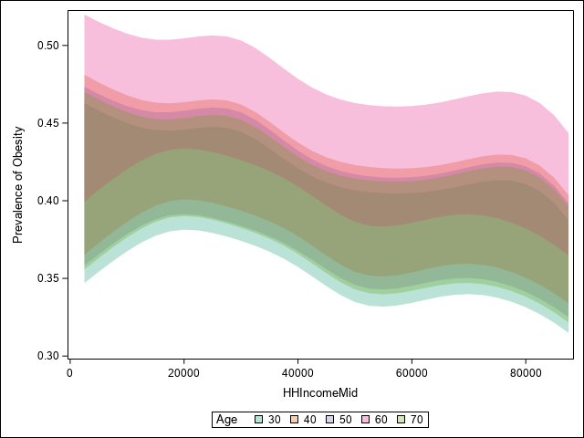

```{r global-options, include=FALSE}
knitr::opts_chunk$set(echo=TRUE, warning=FALSE, message=FALSE,
                      comment=FALSE)
require(SASmarkdown)

saspath <- "C:/Program Files/SASHome/SASFoundation/9.4/sas.exe"
#saspath <- "sas"
```

# Binary (Logistic) Regression with One Categorical Predictor and One Quantitative Predictor

To illustrate a regression model with one categorical predictor and one quantitative predictor, we will develop a logistic regression model for obesity as a function of race and age for the US adult population (age 18-79. Race is a categorical variable with 5 levels (White, Black, Mexican, Hispanic, Other), and age is a quantitative variable. As discussed previously, we prefer to model the effects of quantitative variables using natural cubic splines. 

Our most important modeling decision is our choice of an initial model for the joint effects of race and age, either the additive model or the interaction model. The choice of the initial model depends primarily on the scientific context and, to a lesser extent, on the available sample size. In smaller samples, the number of parameters $p$ (regression coefficients) that can be reliably estimated is $m/15$, where $m$ is the *effective sample size* (for logistic regression, $m$ is the minimum of the number of events and the number of non-events in our sample). In practice, it is common (and quite reasonable) to believe that the effects of most predictor variables are (at least approximately) additive.

In formulating our initial model, our most important modeling decisions are (1) the number of parameters (df) (complexity or degree of nonlinearity) for the age effect and (2) whether to assume additivity or allow for possible interaction between race and age. The choice of the initial model depends primarily on the scientific context and, to a lesser extent, on the available sample size. In smaller samples, the number of parameters $p$ (regression coefficients) that can be reliably estimated is $m/15$, where $m$ is the *effective sample size* (for logistic regression, $m$ is the minimum of the number of events and the number of non-events in our sample). 

As discussed previously, a natural cubic spline with 4 df frequently represents an appropriate balance between flexibility and loss of precision caused by overfitting. Small samples ($N < 30$) may require the use of 2 df, and moderate samples ($N < 100$) may require the use of 3 df. Empirical evidence suggests that more than 4 df are seldom required in a natural cubic spline regression model. Cubic spline models with 5 or 6 df would typically only be considered if the sample size was very large. 

Based on these considerations, we will represent the effect of age using a natural cubic spline with 4 df.

The choice of an additive model or an interaction model should depend primarily on the scientific context. Eventually, as the number of predictors grows, it will be necessary to assume additivity of at least some effects.  Because of this, it is common to make additivity the default assumption. 

In this specific case, in my opinion, an additive model for the effects of race and age is potentially reasonable. 

So, our initial model will an additive logistic regression model for prevalence of obesity with race and age (represented as a natural cubic spline with 4 df).

# Additive Model

We denote the obesity outcome for subject $i$ by $y_i$, the race for subject $i$ by $x_{1i}$, and the age for subject $i$ by $x_{2i}$. 

An additive logistic regression model for (prevalence of) obesity as a function of race and age is 
$$ y_i \sim \mbox{Bernoulli}\left\{p_i\right\} \\
\mbox{logit}\left\{p_i\right\} = \log{\left\{\frac{p_i}{1-p_i}\right\}} = \alpha_0 + f_{r}(x_{1i},{\bf \beta}) + f_{a}(x_{2i},{\bf \gamma})$$

For modeling, race must be recoded into $4~(=5-1)$ numeric (dummy) variables, e.g. $r_1(x_{1}), r_2(x_{1}), r_3(x_{1}), r_4(x_{1})$. 

In our regression model, 
$$f_{r}(x_{1},{\bf \beta}) = \beta_1 r_1(x_{1}) + \beta_2 r_2(x_{1}) + \beta_3 r_3(x_{1}) + \beta_4 r_4(x_{1})$$

For modeling, age will be represented by a *basis* for the natural cubic spline with 4 df (5 knots), e.g. $a_1(x_{2}), a_2(x_{2}), a_3(x_{2}), a_4(x_{2})$. 

In our regression model,
$$f_{a}(x_{2},{\bf \gamma}) = \gamma_1 a_1(x_{2}) + \gamma_2 a_2(x_{2}) + \gamma_3 a_3(x_{2}) + \gamma_4 a_4(x_{2})$$

```{sashtml5 example1, engine.path=saspath, collectcode=TRUE, error=TRUE}
LIBNAME NHANES "../../../BMI552_Datasets/NHANES_May2023/";
*LIBNAME NHANES "~/my_shared_file_links/u48718377/NHANES";
OPTIONS FMTSEARCH=(NHANES.formats_NHANES work) NODATE NONUMBER;
TITLE1; TITLE2;
ODS NOPROCTITLE;
ODS GRAPHICS / LOESSMAXOBS=20000;

DATA Ron;
  SET NHANES.NHANES;

  RENAME Race1=Race;
RUN;

ODS SELECT NONE;
PROC LOGISTIC DATA=Ron;
*  ODS SELECT ClassLevelInfo;
	CLASS Race / ORDER=INTERNAL;
*  ODS SELECT SplineKnots;
  EFFECT AgeCS=SPLINE(Age / NATURALCUBIC BASIS=TPF(NOINT) DEGREE=3 
                            KNOTMETHOD=PERCENTILELIST(5 27.5 50 72.5 95) DETAILS);
    
  MODEL Obese(EVENT="Yes") = Race AgeCS / LINK=LOGIT;

  OUTPUT OUT=Tmp RESCHI=Residual PREDICTED=Fitted; 

  STORE RaceAge;
RUN;
ODS SELECT ALL;
```

## Assessing Adequacy of Modeling Assumptions

Before using the model, we must evaluate the adequacy of the modeling assumptions. For logistic regression models, the only assumptions are correct structural model and independence (which cannot be evaluated based on the observed data).  We can identify potential inadequacies in the representation of the effect of age, e.g. insufficient df, or the assumption of additivity either using informal plots of the residuals against age by race or formal comparisons of fit (AIC) for models with more df devoted to the age effect or models with interaction terms.

```{r example3, engine="sashtml5", engine.path=saspath, collectcode=FALSE, error=TRUE}
PROC SGPANEL DATA=Tmp;
  PANELBY Race / LAYOUT=ROWLATTICE;
	REFLINE 0 / AXIS=Y;
  LOESS X=Age Y=Residual / JITTER; 
RUN;
```

There is some indication of a lack of model fit, particularly the clear trend in the residual plot for Hispanics.

```{r example4, engine="sashtml5", engine.path=saspath, collectcode=FALSE, error=TRUE}
ODS EXCLUDE ALL;
PROC LOGISTIC DATA=Ron;
  ODS OUTPUT GlobalTests=DF4;
 
  CLASS Race / ORDER=INTERNAL;
  EFFECT AgeCS=SPLINE(Age / NATURALCUBIC BASIS=TPF(NOINT) 
                            KNOTMETHOD=PERCENTILELIST(5 27.5 50 72.5 95));
    
  MODEL Obese(EVENT="Yes") = Race AgeCS / LINK=LOGIT;
RUN;

PROC LOGISTIC DATA=Ron;
  ODS OUTPUT GlobalTests=DF5;
 
  CLASS Race / ORDER=INTERNAL;
  EFFECT AgeCS=SPLINE(Age / NATURALCUBIC BASIS=TPF(NOINT) 
                            KNOTMETHOD=PERCENTILELIST(5 23 41 59 77 95));
    
  MODEL Obese(EVENT="Yes") = Race AgeCS / LINK=LOGIT;
RUN;

PROC LOGISTIC DATA=Ron;
  ODS OUTPUT GlobalTests=DF6;
 
  CLASS Race / ORDER=INTERNAL;
  EFFECT AgeCS=SPLINE(Age / NATURALCUBIC BASIS=TPF(NOINT) 
                            KNOTMETHOD=PERCENTILELIST(2.5 18.3333 34.1667 50 65.8333 81.6667 97.5));
    
  MODEL Obese(EVENT="Yes") = Race AgeCS / LINK=LOGIT;
RUN;

PROC LOGISTIC DATA=Ron;
  ODS OUTPUT GlobalTests=Interaction;
 
  CLASS Race / ORDER=INTERNAL;
  EFFECT AgeCS=SPLINE(Age / NATURALCUBIC BASIS=TPF(NOINT) 
                            KNOTMETHOD=PERCENTILELIST(5 27.5 50 72.5 95));
    
  MODEL Obese(EVENT="Yes") = Race AgeCS Race*AgeCS / LINK=LOGIT;
RUN;

DATA DF4;
  SET DF4;
  WHERE Test="Likelihood Ratio";
  
  Model = "Age 4df";
  AIC = ChiSq - 2*(DF+1);

  KEEP Model DF AIC;    
RUN;

DATA DF5;
  SET DF5;
  WHERE Test="Likelihood Ratio";
    
  Model = "Age 5df";
  AIC = ChiSq - 2*(DF+1);

  KEEP Model DF AIC;    
RUN;

DATA DF6;
  SET DF6;
  WHERE Test="Likelihood Ratio";
    
  Model = "Age 6df";
  AIC = ChiSq - 2*(DF+1);

  KEEP Model DF AIC;    
RUN;

DATA Interaction;
  SET Interaction;
  WHERE Test="Likelihood Ratio";
    
  Model = "Interaction";
  AIC = ChiSq - 2*(DF+1);

  KEEP Model DF AIC;    
RUN;

DATA ModelComparisons;
  LENGTH Model $20;

  SET DF4 DF5 DF6 Interaction;
    
  KEEP Model DF AIC;    
RUN;

PROC MEANS DATA=ModelComparisons MAX NOPRINT;
  VAR AIC;
  OUTPUT OUT=MaxIC MAX= / AUTONAME;
RUN;

DATA ModelComparisons;
  IF _N_=1 THEN SET MaxIC;
  SET ModelComparisons;
    
  AIC = AIC_Max - AIC;
    
  KEEP Model DF AIC;
RUN;
ODS EXCLUDE NONE;

TITLE "Model Comparisons (AIC)";
PROC PRINT DATA=ModelComparisons NOOBS;
  VAR Model DF AIC;  
    
  FORMAT AIC 6.1;
RUN;
TITLE;
```

Based on AIC, there is slightly less support for the additive model than for the interaction model, but the evidence is weak and would generally not be sufficient to warrant changing to the interaction model. For now, we will continue with the additive model, but we will revisit the interaction model later for illustrative purposes.

## Odds Ratios for Race Adjusted for Age

ESTIMATE statements can be used to find comparisons of any two races at the same fixed, but unspecified, age.

```{r example5, engine="sashtml5", engine.path=saspath}
ODS EXCLUDE ALL;
PROC PLM RESTORE=RaceAge;
  ODS OUTPUT Estimates=E;

  ESTIMATE "White v Black" Race [1,1] [-1, 2] / CL EXP ALPHA=0.03125;
  ESTIMATE "Mexican v Black" Race [1, 3] [-1, 2] / CL EXP ALPHA=0.03125;
  ESTIMATE "Hispanic v Black" Race [1, 4] [-1, 2] / CL EXP ALPHA=0.03125;
  ESTIMATE "Other v Black" Race [1, 5] [-1, 2] / CL EXP ALPHA=0.03125;
  ESTIMATE "Hispanic v Mexican" Race [1, 4] [-1, 3] / CL EXP ALPHA=0.03125;
RUN;
ODS EXCLUDE NONE;

PROC PRINT DATA=E NOOBS LABEL;
  VAR Label LowerExp ExpEstimate UpperExp;
  LABEL Label='00'x
      LowerExp="Lower CL"
      ExpEstimate="Estimate"
      UpperExp="Upper CL";
  TITLE "Odds Ratios for Race Adjusted for Age";
RUN;
```

Adjusted for age, the odds ratios for obesity are $(0.46,0.65)$ comparing Whites to Blacks, $(0.61,0.98)$ comparing Mexicans to Blacks, $(0.46,0.78)$ comparing Hispanics to Blacks and $(0.23,0.40)$ comparing Other races to Blacks.

## Odds Ratios for Age Adjusted for Race

ESTIMATE statements can be used to find comparisons of two ages for the same fixed, but unspecified, race.

```{r example16, engine="sashtml5", engine.path=saspath}
ODS EXCLUDE ALL;
PROC PLM RESTORE=RaceAge;
  ODS OUTPUT Estimates=E;

  ESTIMATE "Age 20 v 50" AgeCS [1, 20] [-1, 50] / CL EXP ALPHA=0.03125;
  ESTIMATE "Age 30 v 50" AgeCS [1, 30] [-1, 50] / CL EXP ALPHA=0.03125;
  ESTIMATE "Age 40 v 50" AgeCS [1, 40] [-1, 50] / CL EXP ALPHA=0.03125;
  ESTIMATE "Age 50 v 50" AgeCS [1, 50] [-1, 50] / CL EXP ALPHA=0.03125;
  ESTIMATE "Age 60 v 50" AgeCS [1, 60] [-1, 50] / CL EXP ALPHA=0.03125;
  ESTIMATE "Age 70 v 50" AgeCS [1, 70] [-1, 50] / CL EXP ALPHA=0.03125;
  ESTIMATE "Age 80 v 50" AgeCS [1, 80] [-1, 50] / CL EXP ALPHA=0.03125;
RUN;
ODS EXCLUDE NONE;

PROC PRINT DATA=E NOOBS LABEL;
  VAR Label LowerExp ExpEstimate UpperExp;
  LABEL Label='00'x
      LowerExp="Lower CL"
      ExpEstimate="Estimate"
      UpperExp="Upper CL";
  TITLE "Odds Ratios for Age Adjusted for Race";
RUN;
TITLE;
```

Adjusted for race, the odds ratios for obesity are $(0.44,0.68)$ comparing age 20 to age 50, $(0.84,1.19)$ comparing age 30 to age 50, and $(0.95,1.17)$ comparing age 40 to age 50; the odds ratios for obesity are $(1.06,1.39)$ comparing age 60 to age 50, $(0.92,1.25)$ comparing age 60 to age 50, and $(0.62,0.97)$ comparing age 80 to age 50.

## Odds Ratio for Arbitrary Race-Age Combinations

ESTIMATE statements can be used to obtain the odds ratios comparing any two combinations of race and age.

```{r example7, engine="sashtml5", engine.path=saspath}
ODS EXCLUDE ALL;
PROC PLM RESTORE=RaceAge;
  ODS OUTPUT Estimates=E;

  ESTIMATE "Black 30 v White 50" Race [1, 2] [-1, 1]
      AgeCS [1, 30] [-1, 50] / CL EXP ALPHA=0.03125;
  ESTIMATE "Black 40 v White 50" Race [1, 2] [-1, 1]
      AgeCS [1, 40] [-1, 50] / CL EXP ALPHA=0.03125;
  ESTIMATE "Black 50 v White 50" Race [1, 2] [-1, 1]
      AgeCS [1, 50] [-1, 50] / CL EXP ALPHA=0.03125;
  ESTIMATE "Black 60 v White 50" Race [1, 2] [-1, 1]
      AgeCS [1, 60] [-1, 50] / CL EXP ALPHA=0.03125;
  ESTIMATE "Black 70 v White 50" Race [1, 2] [-1, 1]
      AgeCS [1, 70] [-1, 50] / CL EXP ALPHA=0.03125;
RUN;
ODS EXCLUDE NONE;

PROC PRINT DATA=E NOOBS LABEL;
  VAR Label LowerExp ExpEstimate UpperExp;
  LABEL Label='00'x
      LowerExp="Lower CL"
      ExpEstimate="Estimate"
      UpperExp="Upper CL";
  TITLE "Odds Ratios";
RUN;
TITLE;
```

The odds ratios for obesity are $(1.43,2.30)$ comparing 30-year-old Blacks to 50-year-old Whites, $(1.58,2.33)$ comparing 40-year-old Blacks to 50-year-old Whites, $(1.54,2.15)$ comparing 50-year-old Blacks to 50-year-old Whites, $(1.78,2.73)$ comparing 60-year-old Blacks to 50-year-old Whites, and $(1.55,2.45)$ comparing 70-year-old Blacks to 50-year-old Whites. 

Comparisons based on simultaneously changing multiple factors are rarely presented for the additive model.

## Prevalence by Race and Age

ESTIMATE statements can be used to obtain the prevalence of obesity for any combination of race and age. Note that, in the context of the current model, the prevalence of obesity cannot be obtained for a specific race without also specifying a specific age (and vice versa).  There is no single prevalence of obesity for Mexicans.


```{r example8, engine="sashtml5", engine.path=saspath}
ODS EXCLUDE ALL;
PROC PLM RESTORE=RaceAge;
  ODS OUTPUT Estimates=E;

  ESTIMATE "Mexican 30"  Intercept 1 Race [1, 3] 
      AgeCS [1, 30] / CL ILINK ALPHA=0.03125;
  ESTIMATE "Mexican 50"  Intercept 1 Race[1, 3] 
      AgeCS [1, 50] / CL ILINK ALPHA=0.03125;
  ESTIMATE "Mexican 70"  Intercept 1 Race [1, 3] 
      AgeCS [1, 70] / CL ILINK ALPHA=0.03125;
  ESTIMATE "Hispanic 30"  Intercept 1 Race [1, 4] 
      AgeCS [1, 30] / CL ILINK ALPHA=0.03125;
  ESTIMATE "Hispanic 50"  Intercept 1 Race [1, 4] 
      AgeCS [1, 50] / CL ILINK ALPHA=0.03125;
  ESTIMATE "Hispanic 70"  Intercept 1 Race [1, 2] 
      AgeCS [1, 70] / CL ILINK ALPHA=0.03125;
RUN;
ODS EXCLUDE NONE;

PROC PRINT DATA=E NOOBS LABEL;
  VAR Label LowerMu Mu UpperMu;
  LABEL Label='00'x
      Mu="Estimate"
      LowerMu="Lower CL"
      UpperMu="Upper CL";
  TITLE "Prevalence of Obesity (Additive)";
RUN;
TITLE;
```

The estimated prevalence of obesity is $(0.38,0.48)$ for 30-year-old Mexicans, $(0.38,0.48)$ for 50-year-old Mexicans, and $(0.39,0.50)$ for 70-year-old Mexicans; it is $(0.31,0.42)$ for 30-year-old Hispanics, $(0.31,0.42)$ for 50-year-old Hispanics, and $(0.46,0.55)$ for 70-year-old Hispanics.

The estimated regression functions (log odds of obesity as a function of age and race) from the additive model can be plotted using PROC SGPLOT.

```{sashtml5 fitted1, engine.path=saspath, collectcode=TRUE, results='hide'}
ODS EXCLUDE ALL;  
DATA AllAgesAllRaces;
  DO Race = 1 TO 5 BY 1;
    DO Age = 18 TO 79 BY 1;
      OUTPUT;
    END;
  END;
      
  FORMAT Race Race1F.;
RUN;

PROC PLM RESTORE=RaceAge;
  SCORE DATA=AllAgesAllRaces OUT=Fitted Predicted LCLM=Lower_Logit UCLM=Upper_Logit / ALPHA=0.03125;
RUN;
      
DATA Fitted;
  SET Fitted;
      
  Lower_Prob = 1/(1+EXP(-Lower_Logit));
  Upper_Prob = 1/(1+EXP(-Upper_Logit));
RUN;      
ODS EXCLUDE NONE;

PROC SGPLOT DATA=Fitted;
  BAND X=Age Lower=Lower_Logit Upper=Upper_Logit / GROUP=Race TRANSPARENCY=0.7;
  YAXIS LABEL="Log Odds of Obesity";
RUN;
```

```{r, echo=FALSE}
knitr::include_graphics("SGPlot.png")
```

Alternatively, the estimated prevalence of obesity can also be plotted using PROC SGPLOT.

```{r fitted2, engine="sashtml5", engine.path=saspath, collectcode=TRUE, results='hide'}
PROC SGPLOT DATA=Fitted;
  BAND X=Age Lower=Lower_Prob Upper=Upper_Prob /
      GROUP=Race TRANSPARENCY=0.7;
  YAXIS LABEL="Prevalence of Obesity";
RUN;
```

```{r, echo=FALSE}
knitr::include_graphics("SGPlot1.png")
```

## Hypothesis Tests

Likelihood ratio tests can be used to assess the evidence for (1) any effect of race on prevalence of obesity after accounting for age, (2) any effect of age on prevalence of obesity after accounting for race, and (3) non-linearity of the effect of age. In general, one should not reduce the complexity of the model (drop variables) based on the results of a hypothesis test.

```{r example9, engine="sashtml5", engine.path=saspath}
ODS EXCLUDE ALL;
PROC LOGISTIC DATA=Ron;
  ODS OUTPUT GlobalTests=Full;
	CLASS Race / ORDER=INTERNAL;
  EFFECT AgeCS=SPLINE(Age / 
      NATURALCUBIC BASIS=TPF(NOINT) KNOTMETHOD=PERCENTILELIST(5 27.5 50 72.5 95));
    
  MODEL Obese(EVENT="Yes") = Race AgeCS / LINK=LOGIT;
RUN;

PROC LOGISTIC DATA=Ron;
  ODS OUTPUT GlobalTests=LinearAge;
	CLASS Race / ORDER=INTERNAL;
  EFFECT AgeCS=SPLINE(Age / 
      NATURALCUBIC BASIS=TPF(NOINT) KNOTMETHOD=PERCENTILELIST(5 27.5 50 72.5 95));
  
  MODEL Obese(EVENT="Yes") = Race Age / LINK=LOGIT;
RUN;

PROC LOGISTIC DATA=Ron;
  ODS OUTPUT GlobalTests=RaceOnly;
	CLASS Race / ORDER=INTERNAL;
  EFFECT AgeCS=SPLINE(Age / 
      NATURALCUBIC BASIS=TPF(NOINT) KNOTMETHOD=PERCENTILELIST(5 27.5 50 72.5 95));
    
  MODEL Obese(EVENT="Yes") = Race / LINK=LOGIT;
RUN;

PROC LOGISTIC DATA=Ron;
  ODS OUTPUT GlobalTests=AgeOnly;
	CLASS Race / ORDER=INTERNAL;
  EFFECT AgeCS=SPLINE(Age / 
      NATURALCUBIC BASIS=TPF(NOINT) KNOTMETHOD=PERCENTILELIST(5 27.5 50 72.5 95));
    
  MODEL Obese(EVENT="Yes") = AgeCS / LINK=LOGIT;
RUN;

DATA Full;
  SET Full;
  WHERE Test="Likelihood Ratio";
  RENAME ChiSq=ChiSq_Full DF=DF_Full;
RUN;

DATA LinearAge;
  SET LinearAge;
  WHERE Test="Likelihood Ratio";
    
  Model = "Race+Linear Age";
  Test = "Non-Linear Age";
    
  KEEP Model Test ChiSq DF;
RUN;

DATA RaceOnly;
  SET RaceOnly;
  WHERE Test="Likelihood Ratio";
    
  Model = "Race Only";
  Test = "Age";
    
  KEEP Model Test ChiSq DF;
RUN;

DATA AgeOnly;
  SET AgeOnly;
  WHERE Test="Likelihood Ratio";
    
  Model = "Age Only";
  Test = "Race";
    
  KEEP Model Test ChiSq DF;
RUN;

DATA LRTests;
  LENGTH Model $20 Test $20;

  IF _N_ = 1 THEN SET Full;
  SET LinearAge AgeOnly RaceOnly;
    
  Chisq = Chisq_Full-Chisq;
  DF = DF_Full - DF;
  ProbChiSq = EXP(LOGSDF("CHISQUARE",Chisq,DF));
  sValue = -LOG(ProbChiSq)/LOG(2);
    
  KEEP Test DF ChiSq ProbChiSq sValue;    
RUN;
ODS EXCLUDE NONE;

TITLE "Likelihood Ratio Tests";
PROC PRINT DATA=LRTests NOOBS;
  VAR Test DF ChiSq ProbChiSq sValue;  

  FORMAT sValue 6.2;
  FORMAT ChiSq 6.2;
RUN;
TITLE;
```

There is very strong evidence that the prevalence of obesity differs by race $(p \approx 0, s=79.3)$ and by age $(p \approx 0, s=33.6)$.  There is also very strong evidence that age is not-linearly related to the log odds of obesity $(p \approx 0, s=30.5)$.

# Interaction Model

We denote the obesity outcome for subject $i$ by $y_i$, the race for subject $i$ by $x_{1i}$, and the age for subject $i$ by $x_{2i}$. 

A logistic regression model for (prevalence of) obesity as a function of race, age and their interaction is 
$$ y_i \sim \mbox{Bernoulli}\left\{p_i\right\} \\
\mbox{logit}\left\{p_i\right\} = \log{\left\{\frac{p_i}{1-p_i}\right\}} = \alpha_0 + f_{r}(x_{1i},{\bf \beta}) + f_{a}(x_{2i},{\bf \gamma}) + f_{r,a}(x_{1i},x_{2i},{\bf \delta})$$

In our regression model, the interaction term is represented as
$$\begin{eqnarray*}
f_{r,a}(x_{1}, x_{2}, {\bf \delta}) & = & \delta_{11} r_1(x_{1}) \times a_1(x_{2}) + \delta_{12} r_1(x_{1}) \times a_2(x_{2}) + \delta_{13} r_1(x_{1}) \times a_3(x_{2}) + \delta_{14} r_1(x_{1}) \times a_4(x_{2}) + \\
& & \delta_{21} r_2(x_{1}) \times a_1(x_{2}) + \delta_{22} r_2(x_{1}) \times a_2(x_{2}) + \delta_{23} r_2(x_{1}) \times a_3(x_{2}) + \delta_{24} r_2(x_{1}) \times a_4(x_{2}) + \\
& & \delta_{31} r_3(x_{1}) \times a_1(x_{2}) + \delta_{32} r_3(x_{1}) \times a_2(x_{2}) + \delta_{33} r_3(x_{1}) \times a_3(x_{2}) + \delta_{34} r_4(x_{1}) \times a_3(x_{2}) + \\
& & \delta_{41} r_4(x_{1}) \times a_1(x_{2}) + \delta_{42} r_4(x_{1}) \times a_2(x_{2}) + \delta_{43} r_4(x_{1}) \times a_3(x_{2}) + \delta_{44} r_4(x_{1}) \times a_4(x_{2}) \\
\end{eqnarray*}$$

This representation of the interaction term is based on $16~=4 \times 4$ products of the 4 variables used to encode race $r_1(x_1), r_2(x_1), r_3(x_1), r_4(x_1)$ and the 4 variables used to encode age $a_1(x_2), a_2(x_2), a_3(x_2), a_4(x_2)$.

```{r example10, engine="sashtml5", engine.path=saspath, collectcode=TRUE}
ODS SELECT NONE;
PROC LOGISTIC DATA=Ron;
*  ODS SELECT ClassLevelInfo;
	CLASS Race / ORDER=INTERNAL;
*  ODS SELECT SplineKnots;
  EFFECT AgeCS=SPLINE(Age / NATURALCUBIC BASIS=TPF(NOINT) DEGREE=3 
                            KNOTMETHOD=PERCENTILELIST(5 27.5 50 72.5 95) DETAILS);
    
  MODEL Obese(EVENT="Yes") = Race AgeCS Race*AgeCS/ LINK=LOGIT;

  OUTPUT OUT=Tmp RESCHI=Residual PREDICTED=Fitted; 

  STORE RaceAge;
RUN;
ODS SELECT ALL;
```

## Assessing Adequacy of Modeling Assumptions

Before using the model, we must evaluate the adequacy of the modeling assumptions. For binary regression models, the only assumptions are correct structural model and independence (which cannot be evaluated based on the observed data).  We can identify potential inadequacies in the representation of age, e.g. insufficient df, either using informal plots of the residuals against age by race or formal comparisons of fit (AIC) for models with more df devoted to the age effect.

```{r example14, engine="sashtml5", engine.path=saspath}
PROC SGPANEL DATA=Tmp;
  PANELBY Race / LAYOUT=ROWLATTICE;
	REFLINE 0 / AXIS=Y;
  LOESS X=Age Y=Residual / JITTER; 
RUN;
```

The lack of any clear patterns in these plots suggests that the correct structural model assumption is not violated.

```{r example20, engine="sashtml5", engine.path=saspath}
ODS EXCLUDE ALL;
PROC LOGISTIC DATA=Ron;
  ODS OUTPUT GlobalTests=DF4;
 
	CLASS Race / ORDER=INTERNAL;
  EFFECT AgeCS=SPLINE(Age / 
      NATURALCUBIC BASIS=TPF(NOINT) 
      KNOTMETHOD=PERCENTILELIST(5 27.5 50 72.5 95));
    
  MODEL Obese(EVENT="Yes") = Race AgeCS Race*AgeCS / LINK=LOGIT;
RUN;

PROC LOGISTIC DATA=Ron;
  ODS OUTPUT GlobalTests=DF5;
 
  CLASS Race / ORDER=INTERNAL;
  EFFECT AgeCS=SPLINE(Age / 
      NATURALCUBIC BASIS=TPF(NOINT) 
      KNOTMETHOD=PERCENTILELIST(5 23 41 59 77 95));
    
  MODEL Obese(EVENT="Yes") = Race AgeCS Race*AgeCS / LINK=LOGIT;
RUN;

PROC LOGISTIC DATA=Ron;
  ODS OUTPUT GlobalTests=DF6;
 
	CLASS Race / ORDER=INTERNAL;
  EFFECT AgeCS=SPLINE(Age / 
      NATURALCUBIC BASIS=TPF(NOINT) 
      KNOTMETHOD=PERCENTILELIST(2.5 18.3333 34.1667 50 65.8333 81.6667 97.5));
    
  MODEL Obese(EVENT="Yes") = Race AgeCS Race*AgeCS / LINK=LOGIT;
RUN;

DATA DF4;
  SET DF4;
  WHERE Test="Likelihood Ratio";
    
  Model = "Age 4df";
  AIC = ChiSq - 2*(DF+1);

  KEEP Model DF AIC;    
RUN;

DATA DF5;
  SET DF5;
  WHERE Test="Likelihood Ratio";
    
  Model = "Age 5df";
  AIC = ChiSq - 2*(DF+1);

  KEEP Model DF AIC;    
RUN;

DATA DF6;
  SET DF6;
  WHERE Test="Likelihood Ratio";
    
  Model = "Age 6df";
  AIC = ChiSq - 2*(DF+1);

  KEEP Model DF AIC;    
RUN;

DATA ModelComparisons;
  LENGTH Model $20;

  SET DF4 DF5 DF6;
    
  KEEP Model DF AIC;    
RUN;

PROC MEANS DATA=ModelComparisons MAX NOPRINT;
  VAR AIC;
  OUTPUT OUT=MaxIC MAX= / AUTONAME;
RUN;

DATA ModelComparisons;
  IF _N_=1 THEN SET MaxIC;
  SET ModelComparisons;
    
  AIC = AIC_Max - AIC;
    
  KEEP Model DF AIC;
RUN;
ODS EXCLUDE NONE;

TITLE "Model Comparisons (AIC)";
PROC PRINT DATA=ModelComparisons NOOBS;
  VAR Model DF AIC;  
    
  FORMAT AIC 6.1;
RUN;
TITLE;
```

Based on AIC, the best model is the pre-specified model representing the effect of age using a natural cubic spline with 4 df.

## Odds Ratios for Race by Age

ESTIMATE statements can be used to find the odds ratio comparing two races at a given age. 

```{r example23, engine="sashtml5", engine.path=saspath}
ODS EXCLUDE ALL;
PROC PLM RESTORE=RaceAge;
  ODS OUTPUT Estimates=E;

  ESTIMATE "White v Black at Age 30" Race [1, 1] [-1, 2]  
      Race*AgeCS [1, 1 30] [-1, 2 30] / CL EXP ALPHA=0.03125;
  ESTIMATE "White v Black at Age 50" Race [1, 1] [-1, 2]  
      Race*AgeCS [1, 1 50] [-1, 2 50] / CL EXP ALPHA=0.03125;
  ESTIMATE "White v Black at Age 70" Race [1, 1] [-1, 2]  
      Race*AgeCS [1, 1 70] [-1, 2 70] / CL EXP ALPHA=0.03125;
  ESTIMATE "Hispanic v Mexican at Age 30" Race [1, 4] [-1, 3]  
      Race*AgeCS [1, 4 30] [-1, 3 30] / CL EXP ALPHA=0.03125;
  ESTIMATE "Hispanic v Mexican at Age 50" Race [1, 4] [-1, 3]  
      Race*AgeCS [1, 4 50] [-1, 3 50] / CL EXP ALPHA=0.03125;
  ESTIMATE "Hispanic v Mexican at Age 70" Race [1, 4] [-1, 3]  
      Race*AgeCS [1, 4 70] [-1, 3 70] / CL EXP ALPHA=0.03125;
RUN;
ODS EXCLUDE NONE;

PROC PRINT DATA=E NOOBS LABEL;
  VAR Label LowerExp ExpEstimate UpperExp;
  LABEL Label='00'x
      LowerExp="Lower CL"
      ExpEstimate="Estimate"
      UpperExp="Upper CL";
  TITLE "Odds Ratios for Race by Age";
RUN;
TITLE;
```

The odds ratios for obesity comparing Whites to Blacks are $(0.31,0.59)$ at age 30, $(0.46,0.88)$ at age 50, and $(0.48,0.97)$ at age 70.  The odds ratios for obesity comparing Hispanics to Mexicans are $(0.40,1.10)$ at age 30, $(0.51,1.56)$ at age 50, and $(0.56,2.50)$ at age 70.

## Odds Ratios for Age by Race

ESTIMATE statements can be used to find the odds ratio comparing various pairs of ages adjusted for race. 

```{r example24, engine="sashtml5", engine.path=saspath}
ODS EXCLUDE ALL;
PROC PLM RESTORE=RaceAge;
  ODS OUTPUT Estimates=E;

  ESTIMATE "Age 30 v 50 for Blacks" AgeCS [1, 30] [-1, 50] 
      Race*AgeCS [1, 2 30] [-1, 2 50] / CL EXP ALPHA=0.03125;
  ESTIMATE "Age 70 v 50 for Blacks" AgeCS [1, 70] [-1, 50] 
      Race*AgeCS [1, 2 70] [-1, 2 50] / CL EXP ALPHA=0.03125;
  ESTIMATE "Age 30 v 50 for Other" AgeCS [1, 30] [-1, 50] 
      Race*AgeCS [1, 5 30] [-1, 5 50] / CL EXP ALPHA=0.03125;
  ESTIMATE "Age 70 v 50 for Other" AgeCS [1, 70] [-1, 50] 
      Race*AgeCS [1, 5 70] [-1, 5 50] / CL EXP ALPHA=0.03125;
RUN;
ODS EXCLUDE NONE;

PROC PRINT DATA=E NOOBS LABEL;
  VAR Label LowerExp ExpEstimate UpperExp;
  LABEL Label='00'x
      LowerExp="Lower CL"
      ExpEstimate="Estimate"
      UpperExp="Upper CL";
  TITLE "Odds Ratios for Age by Race";
RUN;
TITLE;
```

The odds ratios for obesity comparing 30-year-olds to 50-year-olds are $(0.88,2.27)$ for Blacks and $(0.92,3.58)$ for Other Races. The odds ratios for obesity comparing 70-year-olds to 50-year-olds are $(0.63,1.58)$ for Blacks and $(0.58,2.39)$ for Other Races.

## Odds Ratio for Arbitrary Race-Age Combinations

ESTIMATE statements can be used to obtain the odds ratios comparing any two combinations of race and age.

```{r example25, engine="sashtml5", engine.path=saspath}
ODS EXCLUDE ALL;
PROC PLM RESTORE=RaceAge;
    ODS OUTPUT Estimates=E;

    ESTIMATE "Black 30 v White 50" Race [1, 2] [-1, 1]
        AgeCS [1, 30] [-1, 50] Race*AgeCS [1, 2 30] [-1, 1 50] / CL EXP ALPHA=0.03125;
    ESTIMATE "Black 40 v White 50" Race [1, 2] [-1, 1]
        AgeCS [1, 40] [-1, 50] Race*AgeCS [1, 2 40] [-1, 1 50] / CL EXP ALPHA=0.03125;
    ESTIMATE "Black 50 v White50" Race [1, 2] [-1, 1]
        AgeCS [1, 50] [-1, 50] Race*AgeCS [1, 2 50] [-1, 1 50] / CL EXP ALPHA=0.03125;
    ESTIMATE "Black 60 v White 50" Race [1, 2] [-1, 1]
        AgeCS [1, 60] [-1, 50] Race*AgeCS [1, 2 60] [-1, 1 50] / CL EXP ALPHA=0.03125;
    ESTIMATE "Black 70 v White 50" Race [1, 2] [-1, 1]
        AgeCS [1, 70] [-1, 50] Race*AgeCS [1, 2 70] [-1, 1 50] / CL EXP ALPHA=0.03125;
RUN;
ODS EXCLUDE NONE;

PROC PRINT DATA=E NOOBS LABEL;
    VAR Label LowerExp ExpEstimate UpperExp;
    LABEL Label='00'x
        LowerExp="Lower CL"
        ExpEstimate="Estimate"
        UpperExp="Upper CL";
    TITLE "Odds Ratios";
RUN;
TITLE;
```

The odds ratios for obesity are $(1.62,3.06)$ comparing 30-year-old Blacks to 50-year-old Whites, $(1.60,2.92)$ comparing 40-year-old Blacks to 50-year-old Whites, $(1.14,2.18)$ comparing 50-year-old Blacks to 50-year-old Whites, $(1.08,2.18)$ comparing 60-year-old Blacks to 50-year-old Whites, and $(1.11,2.23)$ comparing 70-year-old Blacks to 50-year-old Whites. 

## Prevalence by Race and Age

ESTIMATE statements can be used to obtain the prevalence of obesity for any combination of race and age. Note that, in the context of the current model, the prevalence of obesity cannot be obtained for a specific race without also specifying a specific age (and vice versa).  There is no single prevalence of obesity for Mexicans.

```{r example26, engine="sashtml5", engine.path=saspath}
ODS EXCLUDE ALL;
PROC PLM RESTORE=RaceAge;
  ODS OUTPUT Estimates=E;

  ESTIMATE "Mexican 30"  Intercept 1 Race [1, 3] 
    AgeCS [1, 30] Race*AgeCS [1, 3 30] / CL ILINK ALPHA=0.03125;
  ESTIMATE "Mexican 50"  Intercept 1 Race[1, 3] 
      AgeCS [1, 50] Race*AgeCS [1, 3 50] / CL ILINK ALPHA=0.03125;
  ESTIMATE "Mexican 70"  Intercept 1 Race [1, 3] 
      AgeCS [1, 70] Race*AgeCS [1, 3 70] / CL ILINK ALPHA=0.03125;
  ESTIMATE "Hispanic 30"  Intercept 1 Race [1, 4] 
      AgeCS [1, 30] Race*AgeCS [1, 4 30] / CL ILINK ALPHA=0.03125;
  ESTIMATE "Hispanic 50"  Intercept 1 Race [1, 4] 
      AgeCS [1, 50] Race*AgeCS [1, 4 50] / CL ILINK ALPHA=0.03125;
  ESTIMATE "Hispanic 70"  Intercept 1 Race [1, 4] 
      AgeCS [1, 70] Race*AgeCS [1, 4 70] / CL ILINK ALPHA=0.03125;
RUN;
ODS EXCLUDE NONE;


PROC PRINT DATA=E NOOBS LABEL;
  VAR Label LowerMu Mu UpperMu;
  LABEL Label='00'x
      Mu="Estimate"
      LowerMu="Lower CL"
      UpperMu="Upper CL";
  TITLE "Prevalence of Obesity (Interaction)";
RUN;
TITLE;
```

The estimated prevalence of obesity is $(0.32,0.48)$ for 30-year-old Mexicans, $(0.36,0.53)$ for 50-year-old Mexicans, and $(0.32,0.58)$ for 70-year-old Mexicans; it is $(0.23,0.40)$ for 30-year-old Hispanics, $(0.32,0.53)$ for 50-year-old Hispanics, and $(0.36,0.62)$ for 70-year-old Hispanics.

The estimated regression functions (log odds of obesity as a function of age and race) from the interaction model can be plotted using PROC SGPLOT.

```{r fitted3, engine="sashtml5", engine.path=saspath, collectcode=TRUE, results='hide'}
ODS EXCLUDE ALL;  
DATA AllAgesAllRaces;
  DO Race = 1 TO 5 BY 1;
    DO Age = 18 TO 79 BY 1;
      OUTPUT;
    END;
  END;
      
  FORMAT Race Race1F.;
RUN;

PROC PLM RESTORE=RaceAge;
  SCORE DATA=AllAgesAllRaces OUT=Fitted Predicted LCLM=Lower_Logit UCLM=Upper_Logit / ALPHA=0.03125;
RUN;
      
DATA Fitted;
  SET Fitted;
      
  Lower_Prob = 1/(1+EXP(-Lower_Logit));
  Upper_Prob = 1/(1+EXP(-Upper_Logit));
RUN;      
ODS EXCLUDE NONE;

PROC SGPLOT DATA=Fitted;
  BAND X=Age Lower=Lower_Logit Upper=Upper_Logit / GROUP=Race TRANSPARENCY=0.7;
  YAXIS LABEL="Log Odds of Obesity";
RUN;
```

```{r, echo=FALSE}
knitr::include_graphics("SGPlot2.png")
```

Alternatively, the estimated prevalence of obesity can also be plotted using PROC SGPLOT.

```{r fitted4, engine="sashtml5", engine.path=saspath, collectcode=TRUE, results='hide'}
PROC SGPLOT DATA=Fitted;
  BAND X=Age Lower=Lower_Prob Upper=Upper_Prob / GROUP=Race TRANSPARENCY=0.7;
  YAXIS LABEL="Prevalence of Obesity";
RUN;
```

```{r, echo=FALSE}

```

## Hypothesis Tests

Likelihood ratio tests can be used to assess the evidence for (1) any effect of race on prevalence of obesity after accounting for age, (2) any effect of age on prevalence of obesity after accounting for race, (3) non-linearity of the effect of age in any or all races, and (4) interaction between race and age. In general, one should not reduce the complexity of the model (drop variables) based on the results of a hypothesis test.

```{r example27, engine="sashtml5", engine.path=saspath}
ODS EXCLUDE ALL;
PROC LOGISTIC DATA=Ron;
  ODS OUTPUT GlobalTests=Full;
	CLASS Race / ORDER=INTERNAL;
  EFFECT AgeCS=SPLINE(Age / 
      NATURALCUBIC BASIS=TPF(NOINT) KNOTMETHOD=PERCENTILELIST(5 27.5 50 72.5 95));
  
  MODEL Obese(EVENT="Yes") = Race AgeCS Race*AgeCS / LINK=LOGIT;
RUN;

PROC LOGISTIC DATA=Ron;
  ODS OUTPUT GlobalTests=Additive;
	CLASS Race / ORDER=INTERNAL;
  EFFECT AgeCS=SPLINE(Age / 
      NATURALCUBIC BASIS=TPF(NOINT) KNOTMETHOD=PERCENTILELIST(5 27.5 50 72.5 95));
  
  MODEL Obese(EVENT="Yes") = Race AgeCS / LINK=LOGIT;
RUN;

PROC LOGISTIC DATA=Ron;
  ODS OUTPUT GlobalTests=LinearAge;
	CLASS Race / ORDER=INTERNAL;
  EFFECT AgeCS=SPLINE(Age / 
      NATURALCUBIC BASIS=TPF(NOINT) KNOTMETHOD=PERCENTILELIST(5 27.5 50 72.5 95));
  
  MODEL Obese(EVENT="Yes") = Race Age Race*Age / LINK=LOGIT;
RUN;

PROC LOGISTIC DATA=Ron;
  ODS OUTPUT GlobalTests=RaceOnly;
	CLASS Race / ORDER=INTERNAL;
  EFFECT AgeCS=SPLINE(Age / 
      NATURALCUBIC BASIS=TPF(NOINT) KNOTMETHOD=PERCENTILELIST(5 27.5 50 72.5 95));
    
  MODEL Obese(EVENT="Yes") = Race / LINK=LOGIT;
RUN;

PROC LOGISTIC DATA=Ron;
  ODS OUTPUT GlobalTests=AgeOnly;
	CLASS Race/ ORDER=INTERNAL;
  EFFECT AgeCS=SPLINE(Age / 
      NATURALCUBIC BASIS=TPF(NOINT) KNOTMETHOD=PERCENTILELIST(5 27.5 50 72.5 95));
    
  MODEL Obese(EVENT="Yes") = AgeCS / LINK=LOGIT;
RUN;

DATA Full;
  SET Full;
  WHERE Test="Likelihood Ratio";

  RENAME ChiSq=ChiSq_Full DF=DF_Full;
RUN;

DATA Additive;
  SET Additive;
  WHERE Test="Likelihood Ratio";
    
  Model = "Additive";
  Test = "Interaction";
    
  KEEP Model Test ChiSq DF;
RUN;

DATA LinearAge;
  SET LinearAge;
  WHERE Test="Likelihood Ratio";
    
  Model = "Race+Linear Age";
  Test = "Non-Linear Age";
    
  KEEP Model Test ChiSq DF;
RUN;

DATA RaceOnly;
  SET RaceOnly;
  WHERE Test="Likelihood Ratio";
    
  Model = "Race Only";
  Test = "Age";
    
  KEEP Model Test ChiSq DF;
RUN;

DATA AgeOnly;
  SET AgeOnly;
  WHERE Test="Likelihood Ratio";
    
  Model = "Age Only";
  Test = "Race";
    
  KEEP Model Test ChiSq DF;
RUN;

DATA LRTests;
  LENGTH Model $20 Test $20;

  IF _N_ = 1 THEN SET Full;
  SET Additive LinearAge AgeOnly RaceOnly;
    
  Chisq = Chisq_Full-Chisq;
  DF = DF_Full - DF;
  ProbChiSq = EXP(LOGSDF("CHISQUARE",Chisq,DF));
  sValue = -LOG(ProbChiSq)/LOG(2);
    
  KEEP Test DF ChiSq ProbChiSq sValue;    
RUN;
ODS EXCLUDE NONE;

TITLE "Likelihood Ratio Tests";
PROC PRINT DATA=LRTests NOOBS;
  VAR Test DF ChiSq ProbChiSq sValue;  

  FORMAT sValue 6.2;
  FORMAT ChiSq 6.2;
RUN;
TITLE;
```

There is strong evidence for an interaction between race and age in their effects on the log odds of obesity $(p=0.007, s=7.1)$.

There is overwhelming evidence for effects of race $(p \approx 0, s=71.2)$ and age $(p \approx 0, s=31.5)$ on the prevelance of obesity.  There is very strong evidence that the relationship between age and the log odds of obesity is non-linear $(p \approx 0, s=26.3)$.

# Recommended Practice (Initial Model: Additive)


```{r practice11, engine="sashtml5", engine.path=saspath, collectcode=TRUE, error=TRUE}
LIBNAME NHANES "../../../BMI552_Datasets/NHANES_May2023/";
*LIBNAME NHANES "~/my_shared_file_links/u48718377/NHANES";
OPTIONS FMTSEARCH=(NHANES.formats_NHANES work) NODATE NONUMBER;
TITLE1; TITLE2;
ODS NOPROCTITLE;
ODS GRAPHICS / LOESSMAXOBS=20000;

ODS SELECT NONE;
PROC LOGISTIC DATA=Ron;
	CLASS Race / ORDER=INTERNAL;
  EFFECT AgeCS=SPLINE(Age / NATURALCUBIC BASIS=TPF(NOINT) DEGREE=3 
                            KNOTMETHOD=PERCENTILELIST(5 27.5 50 72.5 95) DETAILS);
    
  MODEL Obese(EVENT="Yes") = Race AgeCS / LINK=LOGIT;
  STORE Additive;
RUN;
ODS SELECT ALL;
```

For model checking, we would recommend comparisons with the interactive model and a model with additional df for age using BIC.

```{r practice12, engine="sashtml5", engine.path=saspath, collectcode=TRUE, error=TRUE}
TITLE "Additive";
PROC LOGISTIC DATA=Ron;
  ODS SELECT ResponseProfile FitStatistics;

 	CLASS Race / ORDER=INTERNAL;
  EFFECT AgeCS=SPLINE(Age / NATURALCUBIC BASIS=TPF(NOINT) DEGREE=3 
                            KNOTMETHOD=PERCENTILELIST(5 27.5 50 72.5 95) DETAILS);
    
  MODEL Obese(EVENT="Yes") = Race AgeCS / LINK=LOGIT;
RUN;
TITLE;

TITLE "Interactive";
PROC LOGISTIC DATA=Ron;
  ODS SELECT FitStatistics;

 	CLASS Race / ORDER=INTERNAL;
  EFFECT AgeCS=SPLINE(Age / NATURALCUBIC BASIS=TPF(NOINT) DEGREE=3 
                            KNOTMETHOD=PERCENTILELIST(5 27.5 50 72.5 95) DETAILS);
    
  MODEL Obese(EVENT="Yes") = Race AgeCS Race*AgeCS / LINK=LOGIT;
RUN;
TITLE;

TITLE "Age +1df";
PROC LOGISTIC DATA=Ron;
  ODS SELECT FitStatistics;

 	CLASS Race / ORDER=INTERNAL;
  EFFECT AgeCS=SPLINE(Age / NATURALCUBIC BASIS=TPF(NOINT) DEGREE=3 
                            KNOTMETHOD=PERCENTILELIST(5 23 41 59 77 95) DETAILS);
    
  MODEL Obese(EVENT="Yes") = Race AgeCS / LINK=LOGIT;
RUN;
TITLE;
```

```{r calc11, engine="sashtml5", engine.path=saspath, collectcode=TRUE, error=TRUE}
DATA Calculator;
    BIC_Additive = 9272.164 + LOG(2592)*9;
    BIC_Interactive = 9239.105 + LOG(2592)*25;

    Delta_BIC = BIC_Interactive - BIC_Additive;

    KEEP BIC_Additive BIC_Interactive Delta_BIC;   
RUN;

TITLE "BIC Calculator";
PROC PRINT DATA=Calculator NOOBS;
RUN;
TITLE;
```

```{r calc12, engine="sashtml5", engine.path=saspath, collectcode=TRUE, error=TRUE}
DATA Calculator;
    BIC_4df = 9272.164 + LOG(2592)*9;
    BIC_5df = 9270.601 + LOG(2592)*10;

    Delta_BIC = BIC_5df - BIC_4df;

    KEEP BIC_4df BIC_5df Delta_BIC;   
RUN;

TITLE "BIC Calculator";
PROC PRINT DATA=Calculator NOOBS;
RUN;
TITLE;
```

Based on BIC, there are no concerns about the adequacy of the initial model.

If (partial) likelihood ratio tests required, you should fit the relevant models to get the log-likelihoods and calculate the test statistics (and $p$-values) by hand.

```{r practice13, engine="sashtml5", engine.path=saspath, collectcode=TRUE, error=TRUE}
TITLE "Additive";
PROC LOGISTIC DATA=Ron;
  ODS SELECT ResponseProfile FitStatistics;

 	CLASS Race / ORDER=INTERNAL;
  EFFECT AgeCS=SPLINE(Age / NATURALCUBIC BASIS=TPF(NOINT) DEGREE=3 
                            KNOTMETHOD=PERCENTILELIST(5 27.5 50 72.5 95) DETAILS);
   
  MODEL Obese(EVENT="Yes") = Race AgeCS / LINK=LOGIT;
RUN;
TITLE;

TITLE "Age Linear";
PROC LOGISTIC DATA=Ron;
  ODS SELECT FitStatistics;

 	CLASS Race / ORDER=INTERNAL;
  EFFECT AgeCS=SPLINE(Age / NATURALCUBIC BASIS=TPF(NOINT) DEGREE=3 
                            KNOTMETHOD=PERCENTILELIST(5 27.5 50 72.5 95) DETAILS);
    
  MODEL Obese(EVENT="Yes") = Race Age / LINK=LOGIT;
RUN;
TITLE;

TITLE "Race Only";
PROC LOGISTIC DATA=Ron;
  ODS SELECT FitStatistics;

 	CLASS Race / ORDER=INTERNAL;
  EFFECT AgeCS=SPLINE(Age / NATURALCUBIC BASIS=TPF(NOINT) DEGREE=3 
                            KNOTMETHOD=PERCENTILELIST(5 27.5 50 72.5 95) DETAILS);
    
  MODEL Obese(EVENT="Yes") = Race / LINK=LOGIT;
RUN;
TITLE;

TITLE "Age Only";
PROC LOGISTIC DATA=Ron;
  ODS SELECT FitStatistics;

 	CLASS Race / ORDER=INTERNAL;
  EFFECT AgeCS=SPLINE(Age / NATURALCUBIC BASIS=TPF(NOINT) DEGREE=3 
                            KNOTMETHOD=PERCENTILELIST(5 27.5 50 72.5 95) DETAILS);
    
  MODEL Obese(EVENT="Yes") = AgeCS / LINK=LOGIT;
RUN;
TITLE;
```

```{r calc13, engine="sashtml5", engine.path=saspath, collectcode=TRUE, error=TRUE}
DATA Calculator;
    Minus2LL0 = 9317.866;
    Minus2LL1 = 9272.165;

    df0 = 6;
    df1 = 9;

    Chisq = Minus2LL0 - Minus2LL1;    
    df = df1 - df0;
    ProbChiSq = SDF("CHISQURE",Chisq,df);
    sValue = -LOG(ProbChiSq)/LOG(2);
    
    KEEP Chisq df ProbChiSq sValue;   
RUN;

TITLE "Non-Linearity of Age";
PROC PRINT DATA=Calculator NOOBS;
RUN;
TITLE;

DATA Calculator;
    Minus2LL0 = 9325.312;
    Minus2LL1 = 9272.165;

    df0 = 5;
    df1 = 9;

    Chisq = Minus2LL0 - Minus2LL1;    
    df = df1 - df0;
    ProbChiSq = SDF("CHISQURE",Chisq,df);
    sValue = -LOG(ProbChiSq)/LOG(2);
    
    KEEP Chisq df ProbChiSq sValue;   
RUN;

TITLE "Age Overall";
PROC PRINT DATA=Calculator NOOBS;
RUN;
TITLE;

DATA Calculator;
    Minus2LL0 = 9390.268;
    Minus2LL1 = 9272.165;

    df0 = 5;
    df1 = 9;

    Chisq = Minus2LL0 - Minus2LL1;    
    df = df1 - df0;
    ProbChiSq = SDF("CHISQURE",Chisq,df);
    sValue = -LOG(ProbChiSq)/LOG(2);
    
    KEEP Chisq df ProbChiSq sValue;   
RUN;

TITLE "Race Overall";
PROC PRINT DATA=Calculator NOOBS;
RUN;
TITLE;
```

The likelihood ratio test statistic for any *effect* of age is $53.15 = 9325.312-9272.165$ on 4 df, the $p$-value is $7.9 \times {10}^{-11}$, and the $s$-value is $33.6$.  The likelihood ratio test statistic for *non-linear effects* of age is $45.70 = 9317.866-9272.165$ on 3 df, the $p$-value is $6.6 \times {10}^{-10}$, and the $s$-value is $30.5$. The likelihood ratio test statistic for any *effect* of race is $118.103 = 9390.268-9272.165$ on 4 df, the $p$-value is $1.4 \times {10}^{-24}$, and the $s$-value is $79.3$.

```{r practice14, engine="sashtml5", engine.path=saspath, collectcode=FALSE, error=TRUE}
ODS EXCLUDE ALL;
PROC PLM RESTORE=Additive;
    ODS OUTPUT Estimates=E;

    ESTIMATE "Age 30 v 50" AgeCS [1, 30] [-1, 50] / CL EXP ALPHA=0.03125;
    ESTIMATE "Age 40 v 50" AgeCS [1, 40] [-1, 50] / CL EXP ALPHA=0.03125;
    ESTIMATE "Age 60 v 50" AgeCS [1, 60] [-1, 50] / CL EXP ALPHA=0.03125;
    ESTIMATE "Age 70 v 50" AgeCS [1, 70] [-1, 50] / CL EXP ALPHA=0.03125;
    ESTIMATE "Age 80 v 50" AgeCS [1, 80] [-1, 50] / CL EXP ALPHA=0.03125;
RUN;
ODS EXCLUDE NONE;

PROC PRINT DATA=E NOOBS LABEL;
  VAR Label LowerExp ExpEstimate UpperExp;
  LABEL Label='00'x
      LowerExp="Lower CL"
      ExpEstimate="Estimate"
      UpperExp="Upper CL";
  TITLE "Odds Ratios (Main Effect of Age)";
RUN;
TITLE;
```

```{r practice15, engine="sashtml5", engine.path=saspath, collectcode=FALSE, error=TRUE}
ODS EXCLUDE ALL;
PROC PLM RESTORE=Additive;
    ODS OUTPUT Estimates=E;

  ESTIMATE "White v Black" Race [1,1] [-1, 2] / CL EXP ALPHA=0.03125;
  ESTIMATE "Mexican v Black" Race [1, 3] [-1, 2] / CL EXP ALPHA=0.03125;
  ESTIMATE "Hispanic v Black" Race [1, 4] [-1, 2] / CL EXP ALPHA=0.03125;
  ESTIMATE "Other v Black" Race [1, 5] [-1, 2] / CL EXP ALPHA=0.03125;
  ESTIMATE "Hispanic v Mexican" Race [1, 4] [-1, 3] / CL EXP ALPHA=0.03125;
RUN;
ODS EXCLUDE NONE;

PROC PRINT DATA=E NOOBS LABEL;
  VAR Label LowerExp ExpEstimate UpperExp;
  LABEL Label='00'x
      LowerExp="Lower CL"
      ExpEstimate="Estimate"
      UpperExp="Upper CL";
  TITLE "Odds Ratios (Main Effect of Race)";
RUN;
TITLE;
```

# Recommended Practice (Initial Model: Interactive)

```{r practice21, engine="sashtml5", engine.path=saspath, collectcode=TRUE, error=TRUE}
LIBNAME NHANES "../../../BMI552_Datasets/NHANES_May2023/";
*LIBNAME NHANES "~/my_shared_file_links/u48718377/NHANES";
OPTIONS FMTSEARCH=(NHANES.formats_NHANES work) NODATE NONUMBER;
TITLE1; TITLE2;
ODS NOPROCTITLE;
ODS GRAPHICS / LOESSMAXOBS=20000;

ODS SELECT NONE;
PROC LOGISTIC DATA=Ron;
	CLASS Race / ORDER=INTERNAL;
  EFFECT AgeCS=SPLINE(Age / NATURALCUBIC BASIS=TPF(NOINT) DEGREE=3 
                            KNOTMETHOD=PERCENTILELIST(5 27.5 50 72.5 95) DETAILS);
    
  MODEL Obese(EVENT="Yes") = Race AgeCS Race*AgeCS / LINK=LOGIT;
  STORE Interactive;
RUN;
ODS SELECT ALL;
```

For model checking, we would recommend comparisons with the interactive model and a model with additional df for age using BIC.

```{r practice22, engine="sashtml5", engine.path=saspath, collectcode=TRUE, error=TRUE}
TITLE "Interactive";
PROC LOGISTIC DATA=Ron;
  ODS SELECT FitStatistics;

 	CLASS Race / ORDER=INTERNAL;
  EFFECT AgeCS=SPLINE(Age / NATURALCUBIC BASIS=TPF(NOINT) DEGREE=3 
                            KNOTMETHOD=PERCENTILELIST(5 27.5 50 72.5 95) DETAILS);
    
  MODEL Obese(EVENT="Yes") = Race AgeCS Race*AgeCS / LINK=LOGIT;
RUN;
TITLE;

TITLE "Age +1df";
PROC LOGISTIC DATA=Ron;
  ODS SELECT FitStatistics;

 	CLASS Race / ORDER=INTERNAL;
  EFFECT AgeCS=SPLINE(Age / NATURALCUBIC BASIS=TPF(NOINT) DEGREE=3 
                            KNOTMETHOD=PERCENTILELIST(5 23 41 59 77 95) DETAILS);
    
  MODEL Obese(EVENT="Yes") = Race AgeCS Race*AgeCS / LINK=LOGIT;
RUN;
TITLE;
```

```{r calc21, engine="sashtml5", engine.path=saspath, collectcode=TRUE, error=TRUE}
DATA Calculator;
    BIC_Initial = 9239.105 + LOG(2592)*25;
    BIC_Age5df = 9230.677 + LOG(2592)*30;

    Delta_BIC = BIC_Age5df - BIC_Initial;

    KEEP BIC_Initial BIC_Age5df Delta_BIC;   
RUN;

TITLE "BIC Calculator";
PROC PRINT DATA=Calculator NOOBS;
RUN;
TITLE;
```

Based on BIC, there are no concerns about the adequacy of the initial model.

If (partial) likelihood ratio tests required, you should fit the relevant models to get the log-likelihoods and calculate the test statistics (and $p$-values) by hand.

```{r practice23, engine="sashtml5", engine.path=saspath, collectcode=TRUE, error=TRUE}
TITLE "Interactive";
PROC LOGISTIC DATA=Ron;
  ODS SELECT FitStatistics;

 	CLASS Race / ORDER=INTERNAL;
  EFFECT AgeCS=SPLINE(Age / NATURALCUBIC BASIS=TPF(NOINT) DEGREE=3 
                            KNOTMETHOD=PERCENTILELIST(5 27.5 50 72.5 95) DETAILS);
    
  MODEL Obese(EVENT="Yes") = Race AgeCS Race*AgeCS / LINK=LOGIT;
RUN;
TITLE;

TITLE "Additive";
PROC LOGISTIC DATA=Ron;
  ODS SELECT FitStatistics;

 	CLASS Race / ORDER=INTERNAL;
  EFFECT AgeCS=SPLINE(Age / NATURALCUBIC BASIS=TPF(NOINT) DEGREE=3 
                            KNOTMETHOD=PERCENTILELIST(5 27.5 50 72.5 95) DETAILS);
    
  MODEL Obese(EVENT="Yes") = Race AgeCS / LINK=LOGIT;
RUN;
TITLE;

TITLE "Age Only";
PROC LOGISTIC DATA=Ron;
  ODS SELECT FitStatistics;

 	CLASS Race / ORDER=INTERNAL;
  EFFECT AgeCS=SPLINE(Age / NATURALCUBIC BASIS=TPF(NOINT) DEGREE=3 
                            KNOTMETHOD=PERCENTILELIST(5 27.5 50 72.5 95) DETAILS);
    
  MODEL Obese(EVENT="Yes") = AgeCS / LINK=LOGIT;
RUN;
TITLE;
```

```{r calc22, engine="sashtml5", engine.path=saspath, collectcode=TRUE, error=TRUE}
DATA Calculator;
    Minus2LL0 = 9272.164;
    Minus2LL1 = 9239.105;

    df0 = 9;
    df1 = 25;

    Chisq = Minus2LL0 - Minus2LL1;    
    df = df1 - df0;
    ProbChiSq = SDF("CHISQURE",Chisq,df);
    sValue = -LOG(ProbChiSq)/LOG(2);
    
    KEEP Chisq df ProbChiSq sValue;   
RUN;

TITLE "Chi-Square Calculator";
PROC PRINT DATA=Calculator NOOBS;
RUN;
TITLE;

DATA Calculator;
    Minus2LL0 = 9390.268;
    Minus2LL1 = 9239.105;

    df0 = 5;
    df1 = 25;

    Chisq = Minus2LL0 - Minus2LL1;    
    df = df1 - df0;
    ProbChiSq = SDF("CHISQURE",Chisq,df);
    sValue = -LOG(ProbChiSq)/LOG(2);
    
    KEEP Chisq df ProbChiSq sValue;   
RUN;

TITLE "Chi-Square Calculator";
PROC PRINT DATA=Calculator NOOBS;
RUN;
TITLE;
```


The likelihood ratio test statistic for interaction between age and race is $33.06 = 9272.164-9239.105$ on 16 df, the $p$-value is $0.007$, and the $s$-value is $7.1$.
The likelihood ratio test statistic for any *effect* of race is $151.16 = 9390.268-9239.105$ on 20 df, the $p$-value is $2.8 \times 10{-22} \approx 0$, and the $s$-value is $71.2$.  

```{r practice24, engine="sashtml5", engine.path=saspath, collectcode=FALSE, error=TRUE}
ODS EXCLUDE ALL;
PROC PLM RESTORE=Interactive;
  ODS OUTPUT Estimates=E;

  ESTIMATE "White v Black at Age 30" Race [1, 1] [-1, 2]  
      Race*AgeCS [1, 1 30] [-1, 2 30] / CL EXP ALPHA=0.03125;
  ESTIMATE "White v Black at Age 50" Race [1, 1] [-1, 2]  
      Race*AgeCS [1, 1 50] [-1, 2 50] / CL EXP ALPHA=0.03125;
  ESTIMATE "White v Black at Age 70" Race [1, 1] [-1, 2]  
      Race*AgeCS [1, 1 70] [-1, 2 70] / CL EXP ALPHA=0.03125;
  ESTIMATE "Hispanic v Mexican at Age 30" Race [1, 4] [-1, 3]  
      Race*AgeCS [1, 4 30] [-1, 3 30] / CL EXP ALPHA=0.03125;
  ESTIMATE "Hispanic v Mexican at Age 50" Race [1, 4] [-1, 3]  
      Race*AgeCS [1, 4 50] [-1, 3 50] / CL EXP ALPHA=0.03125;
  ESTIMATE "Hispanic v Mexican at Age 70" Race [1, 4] [-1, 3]  
      Race*AgeCS [1, 4 70] [-1, 3 70] / CL EXP ALPHA=0.03125;
RUN;
ODS EXCLUDE NONE;

PROC PRINT DATA=E NOOBS LABEL;
  VAR Label LowerExp ExpEstimate UpperExp;
  LABEL Label='00'x
      LowerExp="Lower CL"
      ExpEstimate="Estimate"
      UpperExp="Upper CL";
  TITLE "Odds Ratios for Race by Age";
RUN;
TITLE;
```


